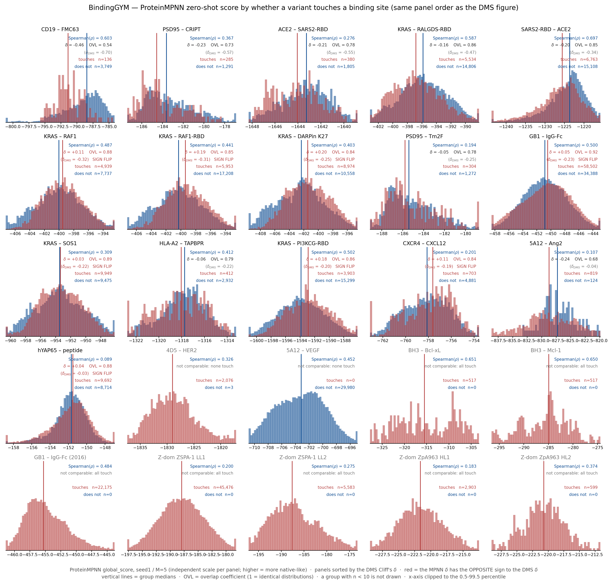
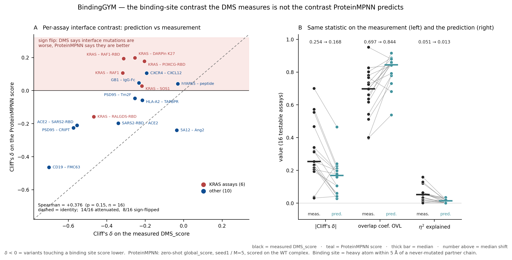

# ProteinMPNN 的 zero-shot 打分在 binding-site / 非 binding-site 上的分布差异
（project `binding-sites-analysis-pred` · 创建 2026-09-02 · status: **DONE**）

## 1. 目标 / 假设

**待检验的假设（用户提出）：** 真实 DMS_score 上，「碰 binding site」与「不碰」两组存在分布差异
（已由 `../binding-sites-analysis/BindingGYM_binding_sites_20260829.md` §5 建立）。
而预训练 ProteinMPNN **只建模折叠过程中 sequence–structure 的 compatibility**，
对「这个位点是不是界面」缺乏感知，因此它在这两组上的**相对分布差异应当与 ground-truth DMS 不一样**。
若成立 ⇒ 为 binding-site-aware 的 ProteinMPNN TTT（complexTTT）提供动机。

## 2. 是否需要重跑打分 —— **不需要，已有且已验证**

per-variant 分数**早已存在**（上一条分支的 4.0 GPU-h 产出），所以**没有启动新的 GPU 任务**：

- workstation `/data/guoj0f/BindingGYM-zero-shot-proteinMPNN/scores/seed1_M5/` —— **25/25 assay 齐全**，329 MB
- 本地此前只有**逐 assay 汇总**（`per_assay_all_runs.csv`），**没有** per-variant ⇒ 这次把 per-variant 拉下来了
- 其余 seed（2–5）只有 10 个 assay，是当时测噪声地板用的子集，不完整

**三道 gate 全部通过**（`p1_merge_scores.py`，任一不过就 assert 失败）：

| gate | 检验 | 结果 |
|---|---|---|
| (a) | 分数 csv 行数 == 官方 DMS csv 行数 | **25/25** |
| (b) | 按同样规则去掉 WT 行后，`DMS_score` 与 `variant_labels.parquet` **逐元素相等** ⇒ 位置对齐是**证明**的不是假设的 | **25/25**，376,424 行 |
| (c) | 从这批分数重算逐 assay Spearman，对比记录中的 seed1_M5 | max \|Δρ\| = **6.9e-17**，均值 **0.391356** vs 记录 **0.391356** |

另：`design_score ≡ global_score` 25/25（与既往结论一致）；官方口径用 `global_score` 且**不取负**，
即该列已定向为「越高越像天然序列」，与 DMS 同向（25/25 Spearman 为正）。

## 3. 两组分布（ProteinMPNN 打分）



*与 DMS 图**完全相同的布局与面板顺序**（按 δ_DMS 升序），因此可以逐格对照。
红=碰 binding site、蓝=不碰，竖线=各组中位数。每格右上四行：**蓝色 `Spearman(ρ)`** = 该 assay 的
benchmark 指标；`δ` / `OVL` = 本图这两组的对比与重叠；`(δ_DMS)` = 真值上的同一个量，作参照；
**红色 "SIGN FLIP" = MPNN 的 δ 与 DMS 的 δ 符号相反**。*

### 指标释义（本文所有表与图共用）

| 记号 | 全称 | 它在问什么 | 取值 |
|---|---|---|---|
| **δ** | Cliff's δ（= 2·AUC − 1） | 随机各取一个「碰界面」和一个「不碰」的 variant，**哪边分数更高**？ | −1…+1。**0 = 两组不可区分**；**δ<0 = 碰界面那组更低**；\|δ\| 越大分得越开 |
| **δ_DMS** | 同上，但算在**真实 DMS_score** 上 | 真值给出的界面对比是多少 —— **参照系**。图里每格都印它，是为了和 MPNN 的 δ 直接比 | 同上 |
| **OVL** | overlap coefficient，∫min(f₁,f₂) | 两个分布**重合了多少质量**？ | 0…1。**1 = 完全重合（毫无区分）**，0 = 完全分离 |
| **ρ** | Spearman(MPNN 分数, DMS_score) | 该 assay 上**模型排序得准不准** —— 这就是 BindingGYM 的榜单指标 | −1…+1，越高越准 |
| **η²** | 界面标签解释的方差比例 | 「碰不碰界面」这个**二值标签能解释分数波动的百分之几**？ | 0…1。0.05 = 只解释 5% |
| **P(不碰>碰)** | = (1−δ)/2 | δ 的概率说法：随机各取一个，不碰的那个更高的概率 | 0.5 = 无差异，1.0 = 完全分离 |
| **Cohen's d** | 标准化均值差 | 两组**均值**差了几个标准差 | 0.2/0.5/0.8 ≈ 小/中/大 |
| **q (BH)** | Benjamini–Hochberg 校正后的 p | 差异**是不是噪声**（多重比较已校正） | <0.05 视为显著 |

> **δ 与 ρ 问的是两件不同的事。** ρ 问「模型在这个 assay 上排得准不准」（榜单关心的）；
> δ 问「模型有没有把『界面 vs 非界面』这个区分做对」（本文关心的）。§4 会给出：**两者几乎无关。**

### Table P1  逐 assay：DMS 与 ProteinMPNN 的界面对比

| assay | n 碰 / 不碰 | δ **DMS** | δ **MPNN** | 符号 | OVL DMS | OVL MPNN | η² DMS | η² MPNN | ρ(MPNN, DMS) |
|---|---:|---:|---:|:--:|---:|---:|---:|---:|---:|
| CD19_FMC63_Fitness_7URV | 136 / 3,749 | -0.700 | **-0.465** | 一致 | 0.397 | 0.538 | 0.057 | 0.014 | 0.603 |
| PSD95_CRIPT_1BE9 | 285 / 1,291 | -0.573 | **-0.226** | 一致 | 0.512 | 0.730 | 0.158 | 0.022 | 0.367 |
| ACE2_SARS2-RBD_enrich_6M17 | 380 / 1,805 | -0.554 | **-0.211** | 一致 | 0.400 | 0.780 | 0.120 | 0.019 | 0.276 |
| KRAS_RALGDS-RBD_norfitness_1LFD | 5,534 / 14,806 | -0.467 | **-0.158** | 一致 | 0.617 | 0.860 | 0.128 | 0.013 | 0.587 |
| SARS2-RBD_ACE2_deltaKd_6M0J | 6,763 / 15,108 | -0.339 | **-0.198** | 一致 | 0.661 | 0.846 | 0.051 | 0.025 | 0.697 |
| KRAS_RAF1_norfitness_6VJJ | 4,939 / 7,737 | -0.317 | **+0.107** | **翻转** | 0.735 | 0.881 | 0.063 | 0.010 | 0.487 |
| KRAS_RAF1-RBD_norfitness_6VJJ | 5,953 / 17,208 | -0.312 | **+0.193** | **翻转** | 0.698 | 0.853 | 0.065 | 0.023 | 0.441 |
| KRAS_DARPinK27_norfitness_5O2S | 8,974 / 10,558 | -0.254 | **+0.197** | **翻转** | 0.780 | 0.841 | 0.051 | 0.034 | 0.403 |
| PSD95_Tm2F_1BE9 | 304 / 1,272 | -0.254 | **-0.047** | 一致 | 0.542 | 0.777 | 0.035 | 0.000 | 0.194 |
| GB1_IgG-Fc_fitness_1FCC | 58,502 / 34,388 | -0.232 | **+0.046** | **翻转** | 0.636 | 0.916 | 0.063 | 0.001 | 0.500 |
| KRAS_SOS1_norfitness_8BE4 | 9,949 / 9,475 | -0.217 | **+0.027** | **翻转** | 0.802 | 0.886 | 0.032 | 0.000 | 0.309 |
| HLA-A2_TAPBPR_meanscore_5WER | 412 / 2,932 | -0.215 | **-0.059** | 一致 | 0.725 | 0.791 | 0.018 | 0.002 | 0.412 |
| KRAS_PICK3CG-RBD_norfitness_1HE8 | 3,903 / 15,299 | -0.204 | **+0.178** | **翻转** | 0.697 | 0.859 | 0.019 | 0.016 | 0.502 |
| CXCR4_CXCL12_enrich_8U4O | 703 / 4,881 | -0.193 | **+0.105** | **翻转** | 0.826 | 0.841 | 0.011 | 0.002 | 0.201 |
| 5A12_Ang2_fitness_4ZFG | 819 / 124 | -0.036 | **-0.240** | 一致 | 0.766 | 0.681 | 0.000 | 0.020 | 0.107 |
| hYAP65_peptide_FunctioncalScore_1JMQ | 9,692 / 8,714 | -0.030 | **+0.041** | **翻转** | 0.952 | 0.879 | 0.000 | 0.000 | 0.089 |

**怎么读这张表 —— 三步：**

1. **先比第 3、4 列（δ_DMS vs δ_MPNN）的符号。** 第 5 列直接给了判定。
   「一致」= 模型至少方向对了；「**翻转**」= **真值说碰界面更差，模型说碰界面更好** —— 完全反了。
2. **再比这两个 δ 的绝对值。** 例如 `PSD95_CRIPT`：真值 −0.573（分得很开），模型只有 −0.226
   ——方向对，但**力度只剩不到一半**。
3. **最后看 OVL 那两列。** `KRAS_RALGDS-RBD`：真值 0.617 vs 模型 0.860 ——
   真值下两组还有 38% 的质量是分开的，到了模型这里只剩 14%，**几乎叠成一坨**。

**最后一列 ρ 是个对照：** 它是该 assay 的榜单成绩。看 `KRAS_PI3KCG-RBD` —— ρ = 0.502（全表偏高），
但 δ = **+0.178**（符号翻转）。**排序排得不错，界面区分却是反的。**

**汇总（16 个可检验 assay，判据与 DMS 侧完全一致：两组各 ≥ 30）：**

| | δ<0 的 assay 数 | q<0.05 | \|δ\| 中位 | OVL 中位 | η² 中位 |
|---|---:|---:|---:|---:|---:|
| **DMS（measured）** | **16/16** | 15/16 | 0.254 | 0.697 | 0.051 |
| **ProteinMPNN（predicted）** | **8/16** | 14/16 | **0.168** | **0.844** | **0.013** |

## 4. 与 DMS 分布图的差异 —— 假设成立，而且比"更弱"更强



1. **方向一致性崩了。** DMS 上 δ<0 是 **16/16**（碰界面一律更差）；MPNN 上只有 **8/16**，
   另 **8 个符号翻转** —— MPNN 认为碰界面的突变**更被容忍**。
2. **KRAS 家族最刺眼：6 个 assay 里 5 个符号翻转**（RAF1 +0.107、RAF1-RBD +0.193、
   DARPinK27 +0.197、PI3KCG +0.178、SOS1 +0.027），而 DMS 给的是 −0.20 ~ −0.47。
   这与既往「ProteinMPNN 在 BindingGYM 上基本 partner-blind」的观察同向且互相独立。
3. **效应量整体缩水约一半**：\|δ\| 中位 0.254 → 0.168，**14/16 个 assay 被衰减**，中位比值 **0.470**。
4. **重叠度显著上升**：OVL 中位 0.697 → **0.844**；η² 中位 0.051 → **0.013**（差 ~4×）。
5. **逐 assay 的界面敏感度互不相关**：ρ(δ_DMS, δ_MPNN) = **+0.376，p = 0.15，不显著**。
   即 MPNN 不只是"幅度小"，而是**排序都对不上** —— 它在哪些 assay 上对界面敏感，与真实情况无关。
6. **分布形状也不同**：DMS 普遍**双峰**（死变体堆在下限、功能变体在上限），
   MPNN 是平滑**单峰**近高斯 —— 它没有"死/活"这个模式的概念。

7. **「榜单成绩好」与「界面区分做得对」几乎无关**（这是把 ρ 标进图里之后能直接读出来的）：
   Spearman(ρ, δ_MPNN) = **+0.006, p = 0.98**；Spearman(ρ, \|δ_MPNN\|) = +0.259, p = 0.33；
   8 个符号翻转的 assay 的 ρ 中位 **0.422**，8 个符号一致的是 **0.389**，两组无差异（Mann–Whitney **p = 0.80**）。
   ⇒ **模型在一个 assay 上排得准，完全不保证它把界面对比搞对了。**
   最极端的是 `SARS2-RBD_ACE2`（ρ = **0.697**，全表最高）与 `KRAS_PI3KCG-RBD`（ρ = 0.502，δ = +0.178，符号翻转）。

⇒ **假设成立。** 真实测量里存在的界面对比，在 ProteinMPNN 的预测里被削弱、被混淆、并在半数 assay 上被反转。

> **一条待跟进的线索（不是结论）：** Spearman(ρ, δ_DMS) = **−0.541, p = 0.030** ——
> 真实界面效应越强的 assay，MPNN 的 ρ 反而越高。但这一段我跑了 5 个相关，
> Bonferroni 校正后 p ≈ 0.15、n 只有 16，**当成假设不当成结论**。

## 5. 决定性实验（**尚未跑**，建议下一步）

**monomer control：把 partner 链删掉，只用被突变链的结构重新 zero-shot 打分**，再算同样的 δ。

| 结果 | 解释 |
|---|---|
| δ 基本不变 | MPNN 的界面敏感度**全部来自被突变链自身的结构** ⇒ partner 是"看了但没用" ⇒ **complexTTT 的动机成立且强** |
| δ 明显变化 | MPNN 确实从 partner 提取了信息，只是提取得不好 ⇒ 动机要改写成"提取不充分"而非"感知不到" |

两种结果**都有用** —— 这是唯一能把「partner 的贡献」与「被突变链自身结构的贡献」分开的实验。
**成本估算：** 全量 25 assay × M=5 × seed1 在本 A100 上实测 **≈2.5 h**（记录在上一分支）；
删掉 partner 后结构更小、kNN 图更少节点，预计 **≈1.5–2 GPU-h**。env `bindinggym-zs-mpnn` 已在 workstation 上。

## 6. Caveats

1. **只有 1 个 seed / M=5。** 既往实测 M=20 的逐 assay σ ≈ 0.008（Spearman 尺度）。
   本文的 δ 差异（0.25 vs 0.17，多个符号翻转）远大于该量级，但**δ 本身的 seed 噪声没有直接测过**。
   要加固就用 seed2–5 那 10 个 assay 做配对复算。
2. **9/25 个 assay 不可检验**（一侧子集 < 30），与 DMS 侧同一批，所以两侧的 16 个 assay 完全可比。
3. **界面定义、结构、映射全部沿用** `../binding-sites-analysis/`（D1：到从不被突变的 partner 链 ≤ 5 Å）。
   那边的 caveat 全部继承 —— 尤其 `4ZFF_CHL.pdb` 缺链、以及三个分数口径反常的 assay。
4. **MPNN 的 `global_score` 是 mask 上 NLL 的求和、无长度归一化** ⇒ 跨 assay 绝对值不可比。
   本文所有比较都在 assay 内做，未跨 assay 池化。

## 7. 复现

```
scripts/binding_sites_pred/
  p1_merge_scores.py   拉取的分数 → 三道 gate → variant_labels_with_mpnn.parquet
  p2_stats.py          DMS 与 MPNN 各自的两组统计（同一套估计量）
  p3_plot.py           MPNN 分布图（与 DMS 图同布局同顺序）
  p5_compare.py        对比图（δ 散点 + 配对效应量）
  p6_tables.py         本文 Table P1 / P2
```

- 分数来源：workstation `/data/guoj0f/BindingGYM-zero-shot-proteinMPNN/scores/seed1_M5/`
  （329 MB，**不入 repo**；`p1` 从 scratchpad 读，路径见脚本头）
- 界面标签来源：`../binding-sites-analysis/data/variant_labels.parquet`
- 产物：`data/{variant_labels_with_mpnn.parquet, stats_dms_vs_mpnn.csv, merge_gates.csv}` + 两张图
- 纯 CPU，全流程约 4 分钟。**本次没有启动任何 GPU 任务。**

## 关联

- `../binding-sites-analysis/BindingGYM_binding_sites_20260829.md` —— 界面定义、DMS 侧的分布与统计（本文的对照臂）
- 上一分支 `proteinTTT-proteinGYM-reproduce` 的 `workstation-records/BindingGYM-zero-shot-proteinMPNN/`
  —— 这批分数是怎么跑出来的（协议、seed 语义、噪声地板）
