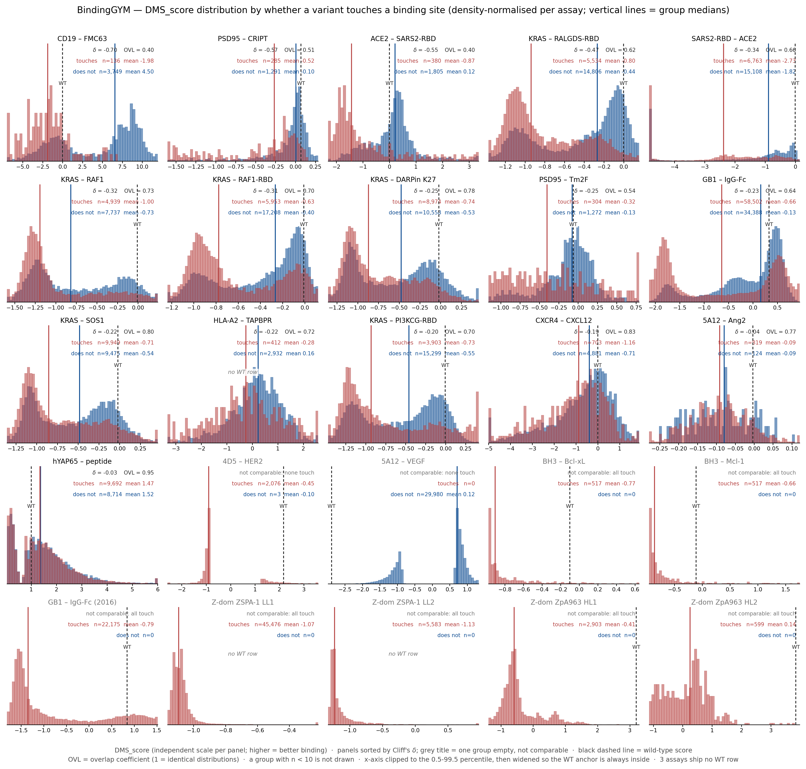

# BindingGYM 的 binding sites：「43% 的 mutants 完全不碰界面」是真的吗

日期 2026-08-29 · 分支 `bindingGYM-binding-sites-analysis` · 全部数字由本记录自带脚本从原始数据重算

---

## 0. 结论先说

| 问题 | 回答 |
|---|---|
| 43% 这个数**算得对吗**？ | **对**。在原口径（D0）下，25 个 assay 的 `frac_no_iface` **未加权均值 = 0.4295**，我独立重算得 **0.429504**，25/25 逐 assay 吻合。 |
| 它**是不是**「43% 的 mutants」？ | **不是**。它是 **assay 未加权均值**；按 variant 加权是 **39.7%**（149,368 / 376,424）。而且它不描述任何一个 assay —— 分布双峰：**9/25 ≤ 0.001、11/25 ≥ 0.61**，中间只有 5 个（0.127–0.540）。 |
| 界面定义**站得住吗**？ | 现在的定义是 **entity-based、与 mutation 无关**，划分由**元数据**定（§2b）。**原定义有 bug**：它把「到结构里**任意其它链**的距离 < 5 Å」当作界面，于是抗体的 **VH–VL packing 也被算成结合界面**。改成「到该 assay 中**从不被突变的 partner 链**」后，assay 均值变成 **0.4697**，variant 加权 **0.4764**。 |
| 这 43% 的 variant 是不是「没信号」？ | **不是**。碰界面的 variant 确实显著更差（16 个可检验 assay 里 15 个 q<0.05、方向全部一致），但**效应量很小**：**OVL 中位 0.697**（两组分布约 70% 重叠）、**P(不碰>碰) 中位 0.627**、**η² 中位 0.051**；不碰界面那一组仍保留全 assay **95%** 的 IQR。见 §5 Figure 1。 |
| **WT 的 DMS_score 能用于 TTT 吗？** | **不能**（§7）。zero-shot 侧完全不接触 label；`intra_*` 微调会见到（但同 assay ~80% 的 label 都见到了），`inter_cluster` 不会。用于 TTT 的收益**上界是 0** —— BindingGYM 的每个 metric 都对预测的单调变换不变（已实测），而 WT 锚点只是一个 per-assay 标量。 |
| **多少分算比 WT 好？** | 22/25 个 assay 带一行 WT 作为锚点，但 WT 的位置从 0.0% 分位跨到 100% 分位。15 个 assay 锚点 ≈ 0（**score > 0 即优于 WT**），7 个是具体数字（查 §6 Table D），**3 个没有 WT 行、无法判断**。超越 WT 是少数事件（正常 assay 2.9%–35%）。 |
| 43% 从哪来？ | **来自文库设计，不是生物学**。10 个 assay 用「≤10 个位点」的设计型小文库（9 个 frac≈0，唯一例外是 5A12_VEGF），15 个 assay 用「≥34 个位点」的饱和扫描（frac 0.37–0.97）。两组 assay 均值 **0.113 vs 0.707**。 |

**一句话**：数字本身是对的，但它是 assay 均值、依赖一个把 VH–VL 也算进去的界面定义，且**不能**用来推出「这批数据里 43% 的信息与结合无关」。

---

## 1. claim 的出处与复现

出处：`complexTTT_baseline_plan_*.md` §6.3「43% 的 variant 完全不碰界面（`frac_variants_no_iface_mut` 均值 0.4295）」，源数据是
`complexTTT-baseline/refs/iface_baselines.csv`。**产生该 csv 的脚本没有留下**，所以这里是一次从零的独立重算。

复现结果（脚本 `scripts/binding_sites/s3_interface.py`，口径 D0，见 §2）：

- 25/25 个 assay 的 `N` **完全相同**，`frac` 最大偏差 **0.0005**（原 csv 只保留 3 位小数）
- assay 未加权均值：原 **0.42948** vs 重算 **0.429504**
- variant 加权：**0.396808**（= 149,368 / 376,424）

⇒ **算术层面完全成立**。下面讨论的是它的**口径**与**含义**。

---

## 2. binding-interface / binding-site 怎么定义

BindingGYM **不提供**界面标注，必须自己从结构算。三个要素：

**(a) 在哪个结构上算。** 每个 assay 只有一个 **WT 复合物**结构（`input/structures/`，22 个文件覆盖 25 assay，其中 15 个是 `_hm` 同源模型）。
没有逐 variant 结构，所以界面是**在野生型坐标上一次算定**、所有 variant 共用。

**(b) 两个 binding entity 是谁。** 关键的一步，也是原口径出错的地方。
**界面是复合物的性质，不是文库的性质** —— 所以这一步**不看 mutation 数据**，
而是把链划分成两个 binding entity `E1` / `E2`。

**唯一权威是元数据**：`DMS_id` 本身就写着两个 partner（`4D5_HER2` = Fab 4D5 vs HER2）。

| assay | E1 | E2 | 划分来源 | 跨界面残基 |
|---|---|---|---|---:|
| `4D5_HER2_fitness_1N8Z` | `AB` = VL+VH (Fab 4D5) | `C` = HER2 | curated from DMS_id | 39 |
| `5A12_Ang2_fitness_4ZFG` | `HL` = VH+VL (Fab 5A12) | `A` = Ang2 | curated from DMS_id | 36 |
| `5A12_VEGF_fitness_4ZFF` | `HL` = VH+VL (Fab 5A12) | `C` = VEGF | curated from DMS_id | 22 |
| *其余 22 个* | — | — | **由链数强制**（2 条链只有一种划分） | 19 – 84 |

**只有 3 个 assay 需要人工指定链归属**，其余 22 个是 2 条链、划分唯一确定，**没有任何可出错的余地**。

> **为什么不用「纯结构」来定划分。** 有一个看起来很漂亮的启发式：枚举所有 2-划分、取跨划分接触
> 最小的那个。它在这 3 个 assay 上确实给出同一答案且余量很大（39 vs 110、36 vs 106、22 vs 98），
> 但它**只是启发式** —— 它假设「被测界面比任何 entity 内部界面都小」。这对 Fab 成立
> （VH–VL 远大于 paratope–epitope），但只要某个 entity 自己的链之间接触很弱、
> 或被测界面恰好是复合物里最大的那个，它就会把切口划进 entity 内部。
> **更要紧的是：拿它去 assert curated 表是有害的** —— 一旦启发式错而 curation 对，
> 它会把正确的分析拦下来。所以现在它只**报告**（`entity_partition.csv` 的 `diag_*` 列，
> 当前 3/3 一致），**不参与决策、也不 gate**。
>
> **真正被 assert 的是「curation 对时不可能失败」的那几条**：每条链恰好被分配一次、
> 两个 entity 都非空、curated 的链 id 在结构里存在、两个 entity 之间确实有接触。

> **与原先「被突变 vs 从不被突变」口径的关系：** 那是一个**数据驱动的代理**。
> 在本 benchmark 上它恰好给出同一个划分 —— 已 assert，**32/32 条被突变链的界面集合逐位相同**，
> 所以本文所有数字不受影响。但它在概念上是错的，且会静默失效：
> **若某个文库只随机化 VH 而不动 VL，VL 会被划成 partner，VH–VL packing 就会被当成结合界面**
> —— 这正是 D0 那个 bug 的小型版。换数据集必须重新核。
> 另一个好处：entity 定义下 **4 个 Z-domain assay 不再是特例**（2 条链 ⇒ 划分唯一，不需要退化处理）。

**(c) 距离判据。** 主口径 **D1**：残基 *i* 是 binding-site 残基 ⟺
*i* 的任一**重原子**到**另一个 entity** 任一重原子的距离 **≤ 5.0 Å**。
**同一 entity 内部的链间接触（如 VH–VL packing）与链内接触都被排除。**

> 说白了就是「这个残基在 WT 复合物里**有没有和 partner 直接接触**」。5 Å 重原子截断是**接触的几何代理**：
> 它覆盖 van der Waals 接触、氢键、盐桥的典型距离，但**不度量相互作用强度**，也不含长程静电与去溶剂化。
> 所以准确的说法是「**是否在结构上直接接触**」，而不是「有没有相互作用」——后者比这个标签能承载的更多。
> 需要连续量时用 `variant_labels.parquet` 里的 `min_dist_to_partner` —— 列名是沿用早期口径的**历史遗留**，
> 它的含义就是「到另一个 entity 的最小重原子距离」（数值未变，见 §2b 的回归 gate）。

对照的另外两个定义：

| id | 定义 | assay 均值 | variant 加权 |
|---|---|---|---|
| **D0** | 到**任意其它链** ≤ 5 Å（**原 plan 用的口径**） | **0.4295** | 0.3968（149,368 / 376,424） |
| **D1** | 到 **partner 侧** ≤ 5 Å（**本文主口径**） | **0.4697** | 0.4764（179,330 / 376,424） |
| **D2** | 复合前后 **ΔSASA > 1 Ų**（Shrake–Rupley，结构生物学的标准界面定义） | 0.4567 | 0.4615 |

D1 的 cutoff 敏感性（assay 均值 / variant 加权）：
4.0 Å **0.501 / 0.533** · 4.5 Å 0.480 / 0.485 · **5.0 Å 0.470 / 0.476** · 6.0 Å 0.438 / 0.436 · 8.0 Å **0.300 / 0.235**

⇒ 在 4–6 Å 这个合理区间内，「不碰界面」的比例稳定在 **44–50%**；D1 与 D2 几乎等价。
**D0 与 D1 的差别几乎全部来自两个抗体家族**（4D5、5A12）：D0 把 **VH–VL 链间 packing** 也算成了界面。

**变体的标签**：一个 variant 只要**有任一**突变位点落在 binding-site 集合里，就算「碰界面」。

### 映射的正确性（做了才敢往下算）

`mutant` 用的是**链内 1-based 序列位置**，结构用 PDB 残基号，两者差一个偏移（KRAS/1LFD 是 +200、PSD95 是 +300、6VJJ 是 −1…）。
做了两条**互相独立**的映射并交叉验证：

1. **经验映射**：数据自带的 `mutant` ↔ `mutant_pdb` 两列直接给出真值（只在被突变过的位点上有定义）
2. **结构映射**：ATOM 记录序列与 `wildtype_sequence` 做 difflib 比对（可处理结构缺失残基）

结果：**25/25 assay、0 处冲突**，且**全部被突变位点都有坐标**（0 处缺失）。
另：`4ZFF` / `4ZFG` 用 Kabat 编号**带 insertion code**（`52A`、`100A`），是全 benchmark 仅有的两个，解析器必须处理。

### 结果的可信度旁证

算出来的界面**逐个落在教科书位置**上，没有做任何人工标注：

- `SARS2-RBD_ACE2_6M0J` → K417, L455, F456, Y473, A475, G476, E484, F486, N487, Y489, Q493, G496, Q498, T500, N501, G502, Y505 —— 正是公认的 RBD–ACE2 接触面
- `ACE2_SARS2-RBD_6M17` → Q24, D30, K31, H34, E35, E37, D38, Y41, Q42, K353, G354, D355, R357
- 6 个 KRAS assay → 全部集中在 **switch I（30–40）+ switch II**
- `PSD95_CRIPT_1BE9` → GLGF 基序（322–325）与肽结合槽

---

### 多链复合物怎么算：以 `4D5_HER2_1N8Z` 为例

`A` = VL (214 aa)、`B` = VH (220 aa)、`C` = HER2 (607 aa，结构中解析 581)。
`E1 = {A, B}`（Fab）、`E2 = {C}`（抗原）。所以只算 **A→C** 与 **B→C**，**A↔B 被排除**。

| 被突变链 | → C (HER2) | → 另一条抗体链 | → B∪C（旧口径 D0） |
|---|---:|---:|---:|
| `A` (VL) | **10** | 46 | 53 |
| `B` (VH) | **10** | 48 | 53 |
| **合计** | **20** | 94 | **106** |

⇒ **D1 给 20 个界面残基，D0 给 106 —— 5.3× 膨胀，几乎全部来自 VH–VL packing**
（VH–VL 界面比抗体–抗原界面大约 2.4 倍）。这是 §2 那个 bug 在单个 assay 上的样子。

9 个库位点到 HER2 的最小重原子距离：

| 链 | 序列位 | WT | →HER2 (Å) | →另一抗体链 (Å) | D1 |
|---|---:|:--:|---:|---:|:--:|
| `A` | 91 / 92 / 93 / 94 | H/Y/T/T | **3.12 / 2.97 / 3.93 / 2.60** | 3.19 / 6.95 / 5.98 / 3.43 | ★★★★ |
| `A` | 97 | T | 9.36 | 5.77 | · |
| `B` | 100 / 101 / 102 / 106 | G/G/D/A | 6.36 / 5.36 / **5.0037** / 6.84 | 6.50 / 8.38 / 10.42 / 3.75 | ···· |

- **VL 的 CDR-L3（91–94）全部直接接触 HER2**；**VH 的库位点（CDR-H3 100–102、106）全在表位边缘之外**
  —— VH 真正接触 HER2 的是 99/103/104/105，库位点被夹在接触残基之间但朝外。`n_lib_pos_site = 4/9` 全来自 VL。
- **`B102` 是全 benchmark 最脆的边界情形：5.0037 Å**，cutoff 动 0.01 Å 就翻。
  该 assay 库位点命中数随 cutoff：4.0/4.5/5.0 Å 均为 **4**，6.0 Å 为 **6**（B101、B102 进来），8.0 Å 为 **8**。

### 逐残基的界面标注（两侧、与 mutation 无关）

`data/interface_residues_all_chains.csv` —— **25 assay × 53 条链的全部 9,493 个残基**，
每行给 `entity / seq_pos / pdb_resid / wt_aa / min_dist_to_other_entity / is_interface_5A`，
其中 **996 个是界面残基**。它覆盖 partner 侧、以及文库从未碰过的位点 —— 这是数据驱动口径给不出来的，
做 complexTTT 时要在 WT 复合物上取界面 mask 就用这个文件。
划分本身在 `data/entity_partition.csv`（含 provenance；`diag_*` 列是结构启发式的诊断，不参与决策）。

---

## 3. 每个 assay 的 binding-sites 范围

### Table A  每个 assay 的 binding-site 残基（D1: heavy-atom ≤ 5 Å to the OTHER entity）

| assay | E1 中被突变的链 | 另一个 entity | binding-site 残基（PDB 编号，逐链） | n_site / L |
|---|---|---|---|---|
| 4D5_HER2_fitness_1N8Z | AB | C | `A`: 30-32,49-50,53,91-94<br>`B`: 33,50,52,57-59,99,103-105 | 20/434 |
| 5A12_Ang2_fitness_4ZFG | HL | A | `H`: 33,35,58,97-99,100A<br>`L`: 27-31,66-68,91-94,96,27A | 21/428 |
| 5A12_VEGF_fitness_4ZFF | HL | C | `H`: 30-32,95-99,100A<br>`L`: 49,53 | 11/424 |
| Z-domain_ZpA963_HL1_fitness_2M5A | AB | (none: both sides mutated) | `A`: 5-6,9-10,13-14,17-18,20,24,27-28,31-32,34-36<br>`B`: 101,105,110,113-114,117-125,127-129,131-132,135 | 37/116 |
| Z-domain_ZpA963_HL2_fitness_2M5A | AB | (none: both sides mutated) | `A`: 5-6,9-10,13-14,17-18,20,24,27-28,31-32,34-36<br>`B`: 101,105,110,113-114,117-125,127-129,131-132,135 | 37/116 |
| Z-domain_ZSPA-1_LL1_fitness_1LP1 | AB | (none: both sides mutated) | `A`: 5-7,9-11,13-14,17,24,27-28,31-36,38<br>`B`: 6-7,9-11,13-14,17-18,24,27-29,31-32,34-35 | 36/109 |
| Z-domain_ZSPA-1_LL2_fitness_1LP1 | AB | (none: both sides mutated) | `A`: 5-7,9-11,13-14,17,24,27-28,31-36,38<br>`B`: 6-7,9-11,13-14,17-18,24,27-29,31-32,34-35 | 36/109 |
| CXCR4_CXCL12_enrich_8U4O | R | J | `R`: 24-30,37,41,45,94,97-98,113,116,178-181,185-187,189,193,200,203,255,259,262,266,268,277,281,284-285,288,292 | 37/295 |
| hYAP65_peptide_FunctioncalScore_1JMQ | A | P | `A`: 22,26,28,30-32,35-39 | 11/46 |
| GB1_IgG-Fc_fitness_1FCC | C | A | `C`: 23-25,27-28,31-32,34-35,39-45,52,54 | 18/56 |
| GB1_IgG-Fc_fitness_1FCC_2016 | C | A | `C`: 23-25,27-28,31-32,34-35,39-45,52,54 | 18/56 |
| SARS2-RBD_ACE2_deltaKd_6M0J | E | A | `E`: 417,446-447,449,453,455-456,473,475-476,484,486-487,489,493,496,498,500-502,505 | 21/194 |
| KRAS_DARPinK27_norfitness_5O2S | A | B | `A`: 3,21,24-25,29-43,52,54,63,66-67,70-71 | 26/165 |
| KRAS_PICK3CG-RBD_norfitness_1HE8 | B | A | `B`: 3,21,24-25,31,33,36-41,64,67,70,73 | 16/166 |
| KRAS_RAF1_norfitness_6VJJ | A | B | `A`: 3,21,24-25,27,29,31,33,36-41,64,67,71 | 17/168 |
| KRAS_RAF1-RBD_norfitness_6VJJ | A | B | `A`: 3,21,24-25,27,29,31,33,36-41,64,67,71 | 17/168 |
| KRAS_RALGDS-RBD_norfitness_1LFD | B | A | `B`: 221,224-225,233-241,256,264,267 | 15/167 |
| KRAS_SOS1_norfitness_8BE4 | R | S | `R`: 5,17-18,21,30-35,37,40,54-61,63-71,73,95,99,102-103,105 | 35/165 |
| BH3_Mcl-1_normed_3KZ0 | C | A | `C`: 2-7,9-11,13-18,21-23 | 18/23 |
| BH3_Bcl-xL_normed_1PQ1 | B | A | `B`: 85-88,90-95,97-102,104-105,108-109 | 20/33 |
| HLA-A2_TAPBPR_meanscore_5WER | A | C | `A`: 6,84,111,113,115,122,125,127-129,132-136,138,141-142,144-146,148,194-196,198,202,227-232,234,244 | 35/265 |
| PSD95_CRIPT_1BE9 | A | B | `A`: 318,322-329,331,339,372,376,379-380 | 15/115 |
| PSD95_Tm2F_1BE9 | A | B | `A`: 318,322-329,331,339-340,372,376,379-380 | 16/115 |
| ACE2_SARS2-RBD_enrich_6M17 | B | E | `B`: 24,27-28,30-31,34-35,37-38,41-42,45,82-83,330,353-355,357,393 | 20/748 |
| CD19_FMC63_Fitness_7URV | C | D | `C`: 155,157,160,162-168,217-223 | 17/218 |

> 残基号为 **PDB 编号**（`mutant_pdb` 那一套）。逐位点、含序列编号的完整清单见 `data/binding_sites_per_chain.csv`。
> 6VJJ 的两个 assay 整体 **+1 偏移**（参考序列多一个前导 G），表内已是其自身编号。

---

## 4. 哪些 mutants 在 binding-sites 上

逐 variant 标签在 **`data/variant_labels.parquet`**（376,424 行；列 `DMS_id / DMS_score / n_mut / min_dist_to_partner / iface_*`，
含 5 个 cutoff、D0 与 D2 各一列）。汇总：

### Table B  库位点 / variant 分组

| assay | n_var | 库位点数 | 其中在 binding-site 上 | n(碰界面) | n(不碰) | frac 不碰 (D1) | frac 不碰 (D0，原口径) |
|---|---:|---:|---:|---:|---:|---:|---:|
| Z-domain_ZpA963_HL1_fitness_2M5A | 2,903 | 6 | 6 | 2,903 | 0 | 0.000 | 0.000 |
| Z-domain_ZSPA-1_LL2_fitness_1LP1 | 5,583 | 8 | 8 | 5,583 | 0 | 0.000 | 0.000 |
| Z-domain_ZSPA-1_LL1_fitness_1LP1 | 45,476 | 9 | 9 | 45,476 | 0 | 0.000 | 0.000 |
| Z-domain_ZpA963_HL2_fitness_2M5A | 599 | 6 | 6 | 599 | 0 | 0.000 | 0.000 |
| GB1_IgG-Fc_fitness_1FCC_2016 | 22,175 | 4 | 4 | 22,175 | 0 | 0.000 | 0.000 |
| BH3_Bcl-xL_normed_1PQ1 | 517 | 10 | 10 | 517 | 0 | 0.000 | 0.000 |
| BH3_Mcl-1_normed_3KZ0 | 517 | 10 | 10 | 517 | 0 | 0.000 | 0.000 |
| 4D5_HER2_fitness_1N8Z | 2,079 | 9 | 4 | 2,076 | 3 | 0.001 | 0.001 |
| 5A12_Ang2_fitness_4ZFG | 943 | 9 | 4 | 819 | 124 | 0.132 | 0.127 |
| GB1_IgG-Fc_fitness_1FCC | 92,890 | 55 | 18 | 58,502 | 34,388 | 0.370 | 0.370 |
| hYAP65_peptide_FunctioncalScore_1JMQ | 18,406 | 34 | 11 | 9,692 | 8,714 | 0.473 | 0.473 |
| KRAS_SOS1_norfitness_8BE4 | 19,424 | 163 | 35 | 9,949 | 9,475 | 0.488 | 0.488 |
| KRAS_DARPinK27_norfitness_5O2S | 19,532 | 163 | 26 | 8,974 | 10,558 | 0.540 | 0.540 |
| KRAS_RAF1_norfitness_6VJJ | 12,676 | 63 | 15 | 4,939 | 7,737 | 0.610 | 0.610 |
| SARS2-RBD_ACE2_deltaKd_6M0J | 21,871 | 194 | 21 | 6,763 | 15,108 | 0.691 | 0.691 |
| KRAS_RALGDS-RBD_norfitness_1LFD | 20,340 | 164 | 15 | 5,534 | 14,806 | 0.728 | 0.728 |
| KRAS_RAF1-RBD_norfitness_6VJJ | 23,161 | 166 | 17 | 5,953 | 17,208 | 0.743 | 0.743 |
| KRAS_PICK3CG-RBD_norfitness_1HE8 | 19,202 | 164 | 16 | 3,903 | 15,299 | 0.797 | 0.797 |
| PSD95_Tm2F_1BE9 | 1,576 | 83 | 16 | 304 | 1,272 | 0.807 | 0.807 |
| PSD95_CRIPT_1BE9 | 1,576 | 83 | 15 | 285 | 1,291 | 0.819 | 0.819 |
| ACE2_SARS2-RBD_enrich_6M17 | 2,185 | 115 | 20 | 380 | 1,805 | 0.826 | 0.826 |
| CXCR4_CXCL12_enrich_8U4O | 5,584 | 295 | 37 | 703 | 4,881 | 0.874 | 0.874 |
| HLA-A2_TAPBPR_meanscore_5WER | 3,344 | 180 | 22 | 412 | 2,932 | 0.877 | 0.877 |
| CD19_FMC63_Fitness_7URV | 3,885 | 218 | 17 | 136 | 3,749 | 0.965 | 0.965 |
| 5A12_VEGF_fitness_4ZFF | 29,980 | 9 | 0 | 0 | 29,980 | 1.000 | 0.001 |

**分布是双峰的，不是集中在 43%：** 8 个 assay ≈ 0.000、1 个 0.132、15 个在 0.370–0.965、1 个 1.000。

**双峰的成因是文库设计。** `n_lib_pos`（该 assay 实际变动过的位点数）在 **10 和 34 之间有一个干净的断层**：

| 文库类型 | assay 数 | variant 数 | frac 不碰界面（assay 均值） | 范围 |
|---|---:|---:|---:|---|
| **设计型小文库**（≤10 个位点：CDR、随机化螺旋、四位点组合） | 10 | 110,772 | **0.113** | 0.000 – 1.000 |
| **饱和扫描**（≥34 个位点，多数覆盖整条链） | 15 | 265,652 | **0.707** | 0.370 – 0.965 |

Spearman(文库覆盖率, frac 不碰界面) = **0.468**（p = 0.018）。
对饱和扫描的 assay，「大部分突变不碰界面」是**几何上的必然**——界面残基只占被突变链的 2.7–32%（中位 12.5%，Table A 的 `n_site/L` 列）。

**唯一的真·异常：`5A12_VEGF_4ZFF`（29,980 个 variant，占全 benchmark 8%）在 D1 下 frac = 1.000。**
同一个 9 位点文库（PDB 编号 H:52A,53,56,57,58 = CDR-H2；L:27A,30,31,34 = CDR-L1）在 Ang2 复合物里有 4 个位点距抗原 3.3–4.0 Å，
在 VEGF 复合物里**最近的一个也有 6.4 Å**（其余 7.7–16.2 Å）。这不是 bug，是这个「双特异」抗体的表位差异；
但它单独就把 D0→D1 的 assay 均值推高约 4 个百分点，引用时必须点名。
（⚠️ caveat 见 §6.2：`4ZFF_CHL.pdb` 只保留了 PDB 6 条链中的 3 条。）

---

## 5. 两组的 DMS_score 有显著差异吗

**有，方向高度一致；但效应量小、两组分布大面积重叠。**

方法：逐 assay 做 Mann–Whitney U（双侧），效应量报 **Cliff's δ**（= 2·AUC−1，δ<0 = 碰界面组分数更低），
另报 **Cohen's d**、**P(不碰 > 碰)**（随机各取一个，不碰的那个更高的概率；0.5 = 无差异）与
**OVL 重叠系数**（∫min(f₁,f₂)，1 = 两分布完全重合、0 = 完全分离）。跨 assay 做 **BH-FDR**。
只在**两侧子集都 ≥ 30** 的 assay 上报（**16/25**）。

**DMS_score 的极性**：官方 `ProteinMPNN_zero_shot_metric.csv` 里 **25/25 个 assay 的 Spearman 全为正**
（0.115–0.696），而 ProteinMPNN 的分数是「越像天然序列越高」⇒ 全 benchmark 统一为**分数越高＝结合/fitness 越好**。
独立旁证：20 个有多重突变深度的 assay 里 17 个 ρ(n_mut, DMS_score) < 0。

### Table C  两组 DMS_score 的差异检验

| assay | n 碰 / 不碰 | **mean** 碰 / 不碰 | median 碰 / 不碰 | sd 碰 / 不碰 | Cliff's δ | P(不碰>碰) | **OVL** | Cohen's d | q (BH) |
|---|---:|---:|---:|---:|---:|---:|---:|---:|---:|
| CD19_FMC63_Fitness_7URV | 136 / 3,749 | **-1.978 / 4.498** | -1.883 / 6.559 | 2.894 / 4.881 | **-0.700** | 0.850 | **0.397** | -1.342 | 9.7e-44 |
| PSD95_CRIPT_1BE9 | 285 / 1,291 | **-0.515 / -0.096** | -0.266 / 0.006 | 0.551 / 0.320 | **-0.573** | 0.786 | **0.512** | -1.125 | 1.3e-51 |
| ACE2_SARS2-RBD_enrich_6M17 | 380 / 1,805 | **-0.871 / 0.122** | -1.433 / 0.207 | 1.410 / 0.917 | **-0.554** | 0.777 | **0.400** | -0.973 | 1.6e-64 |
| KRAS_RALGDS-RBD_norfitness_1LFD | 5,534 / 14,806 | **-0.801 / -0.436** | -0.939 / -0.268 | 0.384 / 0.438 | **-0.467** | 0.733 | **0.617** | -0.862 | <1e-99 |
| SARS2-RBD_ACE2_deltaKd_6M0J | 6,763 / 15,108 | **-2.730 / -1.819** | -2.380 / -0.890 | 1.703 / 1.858 | **-0.339** | 0.670 | **0.661** | -0.502 | <1e-99 |
| KRAS_RAF1_norfitness_6VJJ | 4,939 / 7,737 | **-0.995 / -0.733** | -1.194 / -0.819 | 0.463 / 0.509 | **-0.317** | 0.658 | **0.735** | -0.534 | <1e-99 |
| KRAS_RAF1-RBD_norfitness_6VJJ | 5,953 / 17,208 | **-0.627 / -0.398** | -0.777 / -0.266 | 0.390 / 0.376 | **-0.312** | 0.656 | **0.698** | -0.603 | <1e-99 |
| KRAS_DARPinK27_norfitness_5O2S | 8,974 / 10,558 | **-0.738 / -0.530** | -0.871 / -0.477 | 0.414 / 0.471 | **-0.254** | 0.627 | **0.780** | -0.467 | <1e-99 |
| PSD95_Tm2F_1BE9 | 304 / 1,272 | **-0.321 / -0.134** | -0.402 / -0.077 | 0.550 / 0.339 | **-0.254** | 0.627 | **0.542** | -0.482 | 7.0e-12 |
| GB1_IgG-Fc_fitness_1FCC | 58,502 / 34,388 | **-0.658 / -0.134** | -0.643 / 0.159 | 1.084 / 0.756 | **-0.232** | 0.616 | **0.636** | -0.537 | <1e-99 |
| KRAS_SOS1_norfitness_8BE4 | 9,949 / 9,475 | **-0.706 / -0.541** | -0.855 / -0.484 | 0.454 / 0.446 | **-0.217** | 0.609 | **0.802** | -0.366 | <1e-99 |
| HLA-A2_TAPBPR_meanscore_5WER | 412 / 2,932 | **-0.282 / 0.158** | -0.257 / 0.225 | 1.407 / 1.001 | **-0.215** | 0.608 | **0.725** | -0.416 | 1.7e-12 |
| KRAS_PICK3CG-RBD_norfitness_1HE8 | 3,903 / 15,299 | **-0.725 / -0.553** | -0.933 / -0.460 | 0.553 / 0.479 | **-0.204** | 0.602 | **0.697** | -0.348 | 2.2e-86 |
| CXCR4_CXCL12_enrich_8U4O | 703 / 4,881 | **-1.160 / -0.708** | -0.879 / -0.390 | 1.490 / 1.412 | **-0.193** | 0.596 | **0.826** | -0.318 | 1.6e-16 |
| 5A12_Ang2_fitness_4ZFG | 819 / 124 | **-0.092 / -0.088** | -0.091 / -0.080 | 0.078 / 0.081 | **-0.036** | 0.518 | **0.766** | -0.055 | 5.2e-01 |
| hYAP65_peptide_FunctioncalScore_1JMQ | 9,692 / 8,714 | **1.474 / 1.522** | 1.343 / 1.371 | 1.160 / 1.147 | **-0.030** | 0.515 | **0.952** | -0.042 | 4.4e-04 |

不可检验的 9 个 assay（一侧子集 < 30）：`4D5_HER2_fitness_1N8Z`（不碰组只有 3 个）、
`5A12_VEGF_fitness_4ZFF`（碰组为 0）、`BH3_Bcl-xL_normed_1PQ1`、`BH3_Mcl-1_normed_3KZ0`、
`GB1_IgG-Fc_fitness_1FCC_2016`、4 个 `Z-domain_*`（后 7 个不碰组均为 0）。

### 稳健性与分层

| assay | δ 主口径 | δ depth-分层 | δ ΔSASA 定义 | δ 仅单点突变 | η² |
|---|---:|---:|---:|---:|---:|
| CD19_FMC63_Fitness_7URV | -0.700 | -0.309 | -0.671 | -0.309 | 0.057 |
| PSD95_CRIPT_1BE9 | -0.573 | -0.573 | -0.573 | -0.573 | 0.158 |
| ACE2_SARS2-RBD_enrich_6M17 | -0.554 | -0.554 | -0.498 | -0.554 | 0.120 |
| KRAS_RALGDS-RBD_norfitness_1LFD | -0.467 | -0.441 | -0.417 | -0.461 | 0.128 |
| SARS2-RBD_ACE2_deltaKd_6M0J | -0.339 | -0.228 | -0.270 | -0.336 | 0.051 |
| KRAS_RAF1_norfitness_6VJJ | -0.317 | -0.295 | -0.282 | -0.059 | 0.063 |
| KRAS_RAF1-RBD_norfitness_6VJJ | -0.312 | -0.285 | -0.296 | -0.089 | 0.065 |
| KRAS_DARPinK27_norfitness_5O2S | -0.254 | -0.208 | -0.239 | -0.199 | 0.051 |
| PSD95_Tm2F_1BE9 | -0.254 | -0.254 | -0.247 | -0.254 | 0.035 |
| GB1_IgG-Fc_fitness_1FCC | -0.232 | -0.233 | -0.215 | -0.394 | 0.063 |
| KRAS_SOS1_norfitness_8BE4 | -0.217 | -0.171 | -0.198 | -0.161 | 0.032 |
| HLA-A2_TAPBPR_meanscore_5WER | -0.215 | -0.215 | -0.206 | -0.215 | 0.018 |
| KRAS_PICK3CG-RBD_norfitness_1HE8 | -0.204 | -0.188 | -0.206 | -0.157 | 0.019 |
| CXCR4_CXCL12_enrich_8U4O | -0.193 | -0.193 | -0.194 | -0.193 | 0.011 |
| 5A12_Ang2_fitness_4ZFG | -0.036 | 0.127 | -0.036 | 0.131 | 0.000 |
| hYAP65_peptide_FunctioncalScore_1JMQ | -0.030 | -0.196 | -0.030 | -0.378 | 0.000 |

### Figure 1 — 逐 assay 的分布重叠



*25 个 assay 各一格，密度归一（组内面积=1，所以两组 n 差很多时高度仍可比）。
**红/蓝实线 = 各组中位数，黑色虚线 = WT 锚点**（见 §6；3 个无 WT 行的 assay 标 *no WT row*）。
面板按 Cliff's δ 升序，灰标题 = 一侧子集为空、无法比较；x 轴按各面板的 0.5–99.5 分位裁剪，
**再放宽到把 WT 包进来**（`5A12_VEGF` 与两个 `Z-domain ZpA963` 的 WT 落在 99.5 分位之外，
不放宽就看不到线）；n < 10 的组不画。矢量版 `fig_dms_distribution_by_interface.pdf`，脚本 `s8_plot.py`。*

**读法：**

- **方向：15/16 个 assay q < 0.05 且 δ 全为负** —— 碰界面的 variant 系统性更差。唯一不显著的是 `5A12_Ang2`（δ=−0.036, q=0.52）。
- **但「远好于」谈不上。** 三个口径一致地说这是**弱效应**：
  **OVL 中位 0.697**（两组分布约 70% 的质量是重叠的，范围 0.40–0.95）、
  **P(不碰 > 碰) 中位 0.627**（无差异是 0.50，完全分离是 1.0）、
  **|Cohen's d| 中位 0.492**（中等）、**η² 中位 0.051**（界面标签只解释 5% 的方差）。
- **图上最直观的两件事**：① 除 CD19 外，每一格的红蓝两坨都**大面积压在一起**，只是红色的重心偏左；
  ② 很多 assay 是**双峰**的（死变体堆在下限、功能变体在上限），界面标签改变的是**两个峰的相对高度**，
  而不是把两群分开 —— 典型如 `KRAS–DARPin K27`、`GB1–IgG-Fc`、`KRAS–RAF1-RBD`。
- **稳健**：换 ΔSASA 定义 δ 与主口径 pearson **0.994**（最大偏差 0.07）；只用单点突变重算 15/16 仍为负；
  在 `n_mut` 分层内重算 δ 同号（与原始 δ 相关 0.79），说明**不是突变深度混淆**。
- **连续版本**：ρ(DMS_score, 到 partner 的最小距离) 在 **21/25** 个 assay 为正 —— 离界面越远越不致命，但只是趋势。
- ⚠️ **`CD19_FMC63` 是个例外，别过度解读**：它给出全表最大的 δ（−0.700）与最小的 OVL（0.397），
  但它的分数尺度也最反常（sd 2.9 / 4.9，IQR 9.2）且 ρ(n_mut, DMS_score) = **+0.735**
  （突变越多分数越高，与其余 19 个多深度 assay 方向相反）。它的碰界面组只有 136 个 variant（3.5%）。

## 6. WT 在哪：DMS_score 的绝对锚点

前面 §5 全是 **assay 内的相对比较**，没有回答「多少分算比 WT 好」。BindingGYM 的答案是：
**22/25 个 assay 的 CSV 里带一行 WT**（`mutant` 各链全空、`mutated_sequence` == `wildtype_sequence`，22/22 校验通过），
它就是那个 assay 的锚点；**3 个 assay 完全没有锚点**。

**关键点：WT 不在一个固定位置。** 它的分位数从 **0.0%（5A12_VEGF）跨到 100%（Z-domain ZpA963）**。
按锚点分三组：

- **锚点 ≈ 0（15 个 assay）** —— 分数本身就是相对 WT 的归一化量（`norfitness` / `normed` / `enrich`）。
  **这一组的答案最干脆：`DMS_score > 0` 就是优于 WT。**
- **锚点 ≠ 0（7 个 assay）** —— 阈值是一个具体数字，必须逐 assay 查表（如 4D5 是 **2.166**、GB1_1FCC 是 **0.330**、hYAP65 是 **1.000**）。
- **无 WT 行（3 个）** —— `Z-domain_ZSPA-1_LL1/LL2`、`HLA-A2_TAPBPR`。**这三个 assay 无法判断任何 variant 是否优于 WT。**

### Table D  逐 assay 的 WT 锚点与超越比例

| assay | 分组 | **WT score** | WT 分位 | variant 范围 (min / median / max) | 优于 WT 的比例 | n | 碰界面组 | 不碰组 |
|---|---|---:|---:|---:|---:|---:|---:|---:|
| SARS2-RBD_ACE2_deltaKd_6M0J | 锚点 ≈ 0 | **-0.007** | 97.1% | -4.84 / -1.38 / 0.37 | 2.9% | 642 | 1.2% | 3.7% |
| BH3_Bcl-xL_normed_1PQ1 | 锚点 ≈ 0 | **-0.101** | 94.6% | -0.98 / -0.91 / 1.28 | 5.4% | 28 | 5.4% | — |
| KRAS_RAF1_norfitness_6VJJ | 锚点 ≈ 0 | **-0.009** | 93.0% | -1.86 / -1.05 / 0.58 | 7.0% | 887 | 5.1% | 8.2% |
| BH3_Mcl-1_normed_3KZ0 | 锚点 ≈ 0 | **-0.110** | 90.5% | -0.96 / -0.86 / 2.04 | 9.5% | 49 | 9.5% | — |
| KRAS_RAF1-RBD_norfitness_6VJJ | 锚点 ≈ 0 | **-0.009** | 90.0% | -1.45 / -0.35 / 0.26 | 10.0% | 2,324 | 7.2% | 11.0% |
| KRAS_RALGDS-RBD_norfitness_1LFD | 锚点 ≈ 0 | **-0.000** | 90.0% | -1.60 / -0.43 / 0.28 | 10.0% | 2,042 | 2.2% | 13.0% |
| KRAS_SOS1_norfitness_8BE4 | 锚点 ≈ 0 | **-0.020** | 89.2% | -1.97 / -0.68 / 0.87 | 10.8% | 2,104 | 9.3% | 12.4% |
| KRAS_DARPinK27_norfitness_5O2S | 锚点 ≈ 0 | **-0.020** | 89.1% | -1.97 / -0.68 / 0.87 | 10.9% | 2,122 | 5.9% | 15.1% |
| 5A12_Ang2_fitness_4ZFG | 锚点 ≈ 0 | **-0.003** | 87.4% | -0.34 / -0.09 / 0.31 | 12.6% | 119 | 11.7% | 18.5% |
| KRAS_PICK3CG-RBD_norfitness_1HE8 | 锚点 ≈ 0 | **-0.005** | 87.2% | -1.75 / -0.55 / 0.63 | 12.8% | 2,450 | 14.9% | 12.2% |
| PSD95_CRIPT_1BE9 | 锚点 ≈ 0 | **0.069** | 79.3% | -1.88 / -0.02 / 0.33 | 20.7% | 327 | 5.3% | 24.2% |
| CXCR4_CXCL12_enrich_8U4O | 锚点 ≈ 0 | **0.000** | 65.9% | -5.00 / -0.45 / 3.39 | 34.1% | 1,903 | 22.5% | 35.8% |
| PSD95_Tm2F_1BE9 | 锚点 ≈ 0 | **-0.062** | 54.9% | -1.30 / -0.10 / 0.88 | 45.1% | 711 | 31.9% | 48.3% |
| ACE2_SARS2-RBD_enrich_6M17 | 锚点 ≈ 0 | **0.000** | 44.3% | -2.85 / 0.11 / 3.96 | 55.7% | 1,217 | 20.5% | 63.1% |
| CD19_FMC63_Fitness_7URV | 锚点 ≈ 0 | **0.000** | 29.7% | -8.74 / 6.31 / 13.81 | 70.3% | 2,731 | 16.2% | 72.3% |
| Z-domain_ZpA963_HL1_fitness_2M5A | 锚点 ≠ 0 | **3.197** | 100.0% | -1.59 / -0.59 / 3.11 | 0.0% | 0 | 0.0% | — |
| Z-domain_ZpA963_HL2_fitness_2M5A | 锚点 ≠ 0 | **3.849** | 100.0% | -1.23 / 0.24 / 3.76 | 0.0% | 0 | 0.0% | — |
| 4D5_HER2_fitness_1N8Z | 锚点 ≠ 0 | **2.166** | 95.2% | -3.73 / -0.90 / 5.12 | 4.8% | 100 | 4.8% | — |
| GB1_IgG-Fc_fitness_1FCC_2016 | 锚点 ≠ 0 | **0.843** | 86.8% | -1.99 / -1.35 / 1.73 | 13.2% | 2,938 | 13.2% | — |
| GB1_IgG-Fc_fitness_1FCC | 锚点 ≠ 0 | **0.330** | 65.0% | -2.30 / -0.15 / 1.15 | 35.0% | 32,480 | 32.5% | 39.2% |
| hYAP65_peptide_FunctioncalScore_1JMQ | 锚点 ≠ 0 | **1.000** | 35.4% | 0.01 / 1.35 / 15.56 | 64.6% | 11,894 | 63.3% | 66.1% |
| 5A12_VEGF_fitness_4ZFF | 锚点 ≠ 0 | **-2.882** | 0.0% | -3.50 / 0.71 / 2.99 | 100.0% | 29,973 | — | 100.0% |
| Z-domain_ZSPA-1_LL1_fitness_1LP1 | 无 WT 行 | **—** | — | -1.24 / -1.09 / 3.63 | — | — | — | — |
| Z-domain_ZSPA-1_LL2_fitness_1LP1 | 无 WT 行 | **—** | — | -1.38 / -1.24 / 3.59 | — | — | — | — |
| HLA-A2_TAPBPR_meanscore_5WER | 无 WT 行 | **—** | — | -4.52 / 0.19 / 4.40 | — | — | — | — |

> 「碰界面组 / 不碰组」= 各组中超过 WT 的比例（子集 < 30 时不报）。数据在 `data/wt_reference.csv`。

**读法：**

- **超越 WT 是少数事件**：在 15 个「行为正常」的 assay 上，比例集中在 **2.9%–35%**（KRAS 家族 6 个全在 7.0%–12.8%）。
  两个 Z-domain ZpA963 assay 是 **0.0%** —— WT 就是全库最高分，文库里没有任何组合打得过它。
- **与界面标签联动**：**14/15 个 assay 里，不碰界面的 variant 更容易超过 WT**，中位比值 **1.59×**
  （最极端 `KRAS_RALGDS-RBD` 13.0% vs 2.2%）。唯一反向的是 `KRAS_PICK3CG-RBD`（12.2% vs 14.9%）。
  这与 §5 同向，且是同一件事的绝对刻度版本。
  > **这 15 个是怎么来的**：要同时满足两个条件 —— ① 有 WT 行（否则「超过 WT」没有定义），
  > ② 碰/不碰两组各 ≥ 30 个 variant（否则比例估不准）。即 §5 Table C 的 **16 个**再去掉
  > `HLA-A2_TAPBPR`（它两组都够大，但没有 WT 行）⇒ **15**。
- ⚠️ **WT 给的是一个点，不是一个显著性阈值。** BindingGYM 只发布单列 `DMS_score`，
  **没有 replicate、没有标准误**，所以「比 WT 高 0.01」和「比 WT 高 0.5」在数据里无法区分。
  要声称「真正提升」必须回原始文献取误差，本仓库的数据做不到。

### 三个 assay 的 DMS_score 不像 WT 锚定的结合读数

`5A12_VEGF`、`CD19_FMC63`、`hYAP65_peptide` 同时满足两个反常特征，且**恰好是同一批**：

| assay | 超越 WT 比例 | ρ(n_mut, DMS_score) |
|---|---:|---:|
| `5A12_VEGF_fitness_4ZFF` | **100.0%**（29,980 个里只有 7 个低于 WT） | +0.417 |
| `CD19_FMC63_Fitness_7URV` | **70.3%** | +0.735 |
| `hYAP65_peptide_FunctioncalScore_1JMQ` | **64.6%** | +0.495 |
| *（其余 19 个多深度 assay）* | *中位 10.9%* | *全部 < 0* |

即：**突变越多分数越高，且绝大多数 variant「打得过」WT**。对成熟抗体（5A12）或天然受体（CD19）而言这不合常理。
WT 行本身是干净的（`mutated_sequence` 校验通过），所以这是**分数定义/归一化层面**的问题，不是解析错误。
`5A12_VEGF` 在本记录里已经是第二次被单独点名（§4 的 frac = 1.000）。**用这三个 assay 做任何绝对判断前先回原始文献核对口径。**

---

## 7. WT 的 DMS_score 会被模型接触到吗？能不能用于 TTT？

（2026-08-30 补。证据全部来自本机 BindingGYM repo `/home/guoj0f/repos/BindingGYM` 的实际代码。）

### 7.1 (a) Zero-shot：**完全不接触**

- `grep -rn "DMS_score" modelzoo/ --include=*.py` **返回空** —— 打分侧只吃结构与序列，不读任何 label。
- WT 的 label 只在下游 `calc_metric.py` 里出现，而且**只是 N 行中的一行**
  （`get_zero_shot_metric_df` 断言 `df.shape[0] == orig_df.shape[0]`，WT 行**在评测集里**）。
  它在 517–92,891 行里占 1 行，影响可忽略；3 个 assay 连这一行都没有。
- **关键：没有任何一个 metric 以 WT 为阈值。** `calc_zero_shot_metric` 的二值化是
  **`DMS_score > 90 分位`**（不是 `> WT`），MCC 的预测侧也是自身的 90 分位，
  TopHit/BottomHit 取标签的上/下 10%，NDCG 走 rank。⇒ **WT 在任何一个已发布数字里都没有特殊地位。**

### 7.2 (b) Fine-tuning：**看 split，且这是一条真实的泄漏轴**

| split（`training/main.py --split`） | 切分粒度 | 测试 assay 的 WT label 是否被见过 |
|---|---|---|
| `random` | `KFold(5, shuffle)` over **行** | **是** —— WT 行落进 4/5 折的训练集 |
| `contig` / `mod` | 按**位点**分折；代码把 WT 的 `pos` 显式设为 **0**（`if m == '': pos = 0`） | **是** —— 恒定在 fold 0 的 valid，其余 4 折在 train |
| `inter_cluster` | `GroupKFold` over 官方 `BindingGYM_cluster.tsv` | **否** —— 整簇 held out |

三个 `intra_*` 都是 **assay 内**切分：不只是 WT，该 assay **约 80% 的 label** 都在训练集里 ——
WT 那一行不是「特殊泄漏」，只是普通的一行。**唯一的泛化设置是 `inter_cluster`**
（论文 Table 5 的 0.42、我们复算的 0.422 vs zero-shot 0.397），**在它下面测试 assay 的 WT label 从未被见过**。

### 7.3 能不能用于 test-time training？—— **对 BindingGYM 的指标：不能。三条独立理由，任一条都致命**

**① 秩不变性（决定性，已实测）。** BindingGYM 的每一个 metric 都是 rank / 自身分位数的函数
⇒ 对预测向量的**任意严格单调变换恒等不变**。用真实 assay 实测（`KRAS_RALGDS-RBD`，逐行照抄官方
`calc_zero_shot_metric`）：

| 对预测做的变换 | Spearman | AUC | MCC | NDCG | AP |
|---|---:|---:|---:|---:|---:|
| 原始 | 0.257323 | 0.609187 | 0.059876 | 0.655475 | 0.136143 |
| 减去 WT 的 DMS_score | 0.257323 | 0.609187 | 0.059876 | 0.655475 | 0.136143 |
| 仿射对齐到 WT（a·x+b） | 0.257323 | 0.609187 | 0.059876 | 0.655475 | 0.136143 |
| 任意单调（tanh / exp） | 0.257323 | 0.609187 | 0.059876 | 0.655475 | 0.136143 |

WT 的 DMS_score 是**一个 per-assay 标量**，它能对预测做的最多就是平移/缩放 ⇒ **Δ 恒等于 0**。
即使把它用到极致，榜单上一个数字都不会动。

**② 信息量：对多数 assay 恒为 0，而且是循环的。** §6 已给出 —— 15/25 个 assay 的 WT ≈ 0
是**归一化的定义**（分数本身就是「相对 WT」），不是一次测量；把它喂回模型是同义反复。
3/25 根本没有这一行。真正带信息的只有 7/25，而且仍然只是**一个数**。

**③ 没有可反传的训练信号。** ProteinTTT 的 TTT 是在目标序列上做自监督 MLM。
一个标量 label 无法在 variant 集合上构造梯度 —— 要把 label 变成 loss 至少需要**两个以上**
variant 的相对关系，那已经是有监督微调，不是 TTT。

### 7.4 必须区分的两个「WT 锚点」

| | 是什么 | 要不要 label | 在 BindingGYM 上有没有用 |
|---|---|---|---|
| **WT 的 DMS_score** | 实验测量值 = **label** | 要 | 秩不变 ⇒ 无用（且用了就不再是 zero-shot） |
| **WT 的 model score** | 模型对 WT 复合物的打分 | **不要** | 也是 assay 内**常数** ⇒ 同样秩不变，同样无用 |

第二行值得单独说：既往 audit 已确认 BindingGYM 的 ProteinMPNN 分数是 mask 上 NLL 求和取负，
**没有 WT 项**（ProteinGym 风格的 `score(mt) − score(wt)` 它不做）。补上这一项是**免费且合法**的，
但因为 `score(wt)` 在 assay 内是常数，**它同样不会改变任何 metric**。
它只在两种情况下有意义：**跨 assay 池化**（BindingGYM 是逐 assay 算 ρ 再平均，所以用不上）、
以及把绝对分数放到可比刻度上。

### 7.5 那 WT 锚点什么时候真的有用

- **前瞻性筛选**：「哪些设计超过 WT」是真实的部署问题，需要 WT 锚点 + 校准过的模型分数。
  但这不是 BindingGYM 的任何一个指标，而且 §6 已说明**没有 replicate/标准误**，无法设显著性阈值。
- **诊断**：检查模型给 WT 的分位数是否合理。注意 §6 那三个反常 assay
  （`5A12_VEGF` 的 WT 在 **0 分位**）会让任何 WT 锚定的校准在那里彻底失准。

### 7.6 给 complexTTT 的可执行结论

1. **不要把 WT 的 DMS_score 当作 TTT 信号** —— 它既改不动指标，又会让结果失去 zero-shot 资格。
2. test time 真正可用且 **label-free** 的东西是：**WT 复合物结构**、**MSA**（22 个 .a2m 已在本机）、
   以及**未标注的 test variant 集合本身**（transductive TTT）。这三样都不触碰 label。
3. 任何声称的增益必须在 **`inter_cluster`** 或纯 zero-shot 下报告 —— `intra_*` 的数字含约 80% 的同 assay label。
4. 更一般的纪律：**任何 per-assay 标量、任何对预测的单调后处理，在这个 benchmark 上的收益上界都是 0。**
   要涨分只能改变 **variant 之间的相对排序**。

---

## 8. Caveats

1. **界面算在唯一一个 WT 复合物结构上**，22 个结构里 15 个是同源模型（`_hm`）。没有建模突变引起的构象变化，也没有逐 variant 结构。
2. **`4ZFF_CHL.pdb` 只有 C/H/L 三条链，而 PDB 4ZFF 沉积了 6 条**（VEGF 是同源二聚体）。若表位跨越两个 VEGF 原体，`5A12_VEGF` 的界面会被低估。旁证：把 cutoff 放到 8 Å，该 assay 的 frac 从 1.000 掉到 0.090。这条**没有排除**。
3. **4 个 Z-domain assay 的 frac = 0 是同义反复**：文库随机化的位点本身就是按界面挑的，且 partner 侧为空只能退化处理。它们对 assay 均值贡献 4/25 个 0。
4. **`KRAS_SOS1_8BE4` 与 `KRAS_DARPinK27_5O2S` 的 label 逐值重复**（既往 audit 已定案，见 [[bindinggym-kras-darpink27-corrupted]]）。本记录为完整性两个都保留，做汇总时应按一个计。
5. **界面是二值标签**，把 5.01 Å 与 30 Å 一视同仁。`min_dist_to_partner` 列提供了连续版本。
6. **`CD19_FMC63` 的分数尺度与深度相关性都反常**（ρ(n_mut, score) = +0.735，与其余 19 个多深度 assay 反向），它同时是 Table C 里效应最强的一行——不要把它当代表。
7. **3 个 assay 没有 WT 行**（见 §6），任何依赖绝对阈值的分析在这三个上不可执行。
8. **assay 未加权均值本身就是一把有问题的尺子**：25 个 assay 只有 14 个真实统计簇（KRAS 独占 6 个）。

---

## 9. 复现

```
scripts/binding_sites/
  bg_common.py       PDB 解析（重原子、insertion code）+ 序列/残基号工具
  s1_map_check.py    链序列与 wildtype_sequence 的一致性检查
  s2_build_map.py    经验映射 vs 结构映射的交叉验证（0 冲突）
  s3_interface.py    界面计算（D0/D1/D2 + 5 个 cutoff）与逐 variant 打标签
  s4_stats.py        Mann-Whitney U / Cliff's δ / 深度分层 / BH-FDR
  s5_robust.py       ΔSASA、仅单点、连续距离、文库覆盖率
  s6_tables.py       生成 Table A/B
  s7_stats_ext.py    补 mean / sd / Cohen's d / OVL 重叠系数 / P(不碰>碰)
  s8_plot.py         Figure 1（matplotlib，PNG 300 dpi + 矢量 PDF）
  s9_tableC.py       生成 Table C 与稳健性表
  s10_wt.py          提取每个 assay 的 WT 锚点与超越比例
  s11_wt_table.py    生成 Table D
  s12_metric_invariance.py  实测 BindingGYM 全部 metric 对预测的单调变换不变（§7.3 的判据）
  s13_entity_interface.py   entity 划分（**元数据唯一权威**；纯结构启发式只报告不 gate）
                            与逐残基界面标注；带回归 gate：32/32 条被突变链与旧口径逐位相同
```

输入：`/home/guoj0f/share/BindingGYM/input/`（`BindingGYM.csv` + `Binding_substitutions_DMS/` 25 个 csv + `structures/` 22 个 pdb）。
纯 CPU，全流程约 3 分钟，无 GPU 依赖。产物在 `data/`。

**按 s1 → s12 顺序跑即可，可从任意 cwd 执行**（每个脚本自己把所在目录加进 `sys.path`）。
产物路径只有一处定义 —— `bg_common.py` 的 **`REC_DIR` / `OUT_DIR`**，改路径只改这里，
不要在单个脚本里再写第二个输出目录。

**可复现性**：整条链确定性，重跑后 9 个 csv 与 PNG **逐字节相同**，parquet 内容相同；
PDF 用 `metadata={"CreationDate": None}` 关掉时间戳后也逐字节相同。

依赖：numpy / pandas / scipy / matplotlib（**不需要 biopython**，PDB 解析与 SASA 都是自带实现）。
图内文字用英文：本机只有 DejaVu Sans 能被 matplotlib 用作默认族，中文字形缺失且 Noto CJK 的 fallback 不生效。
