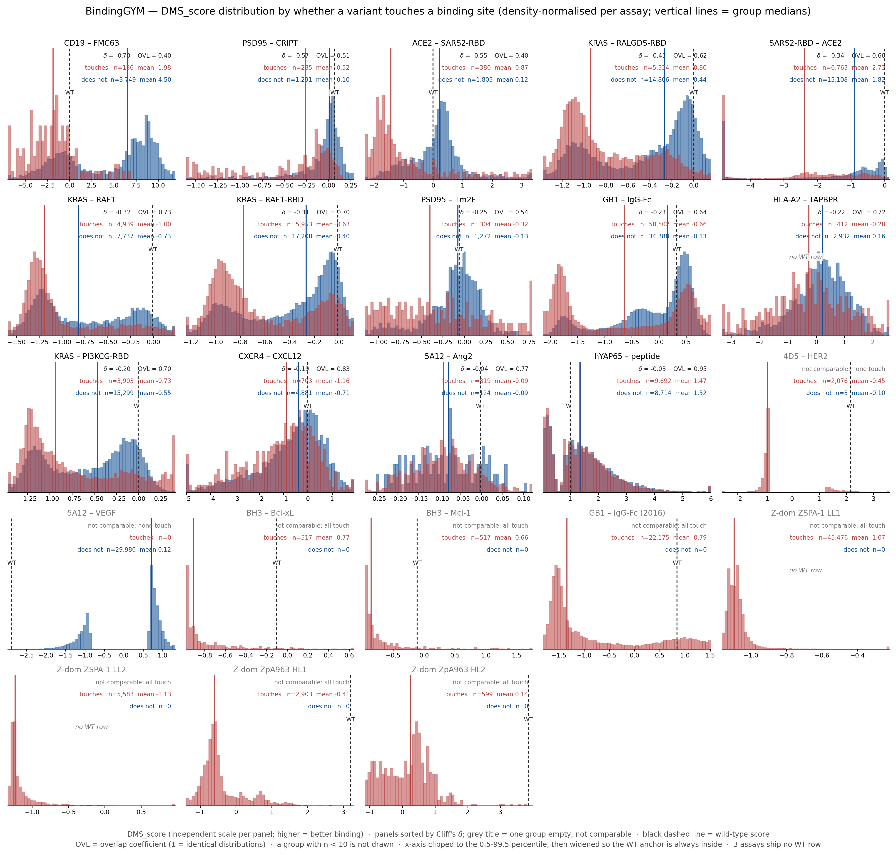
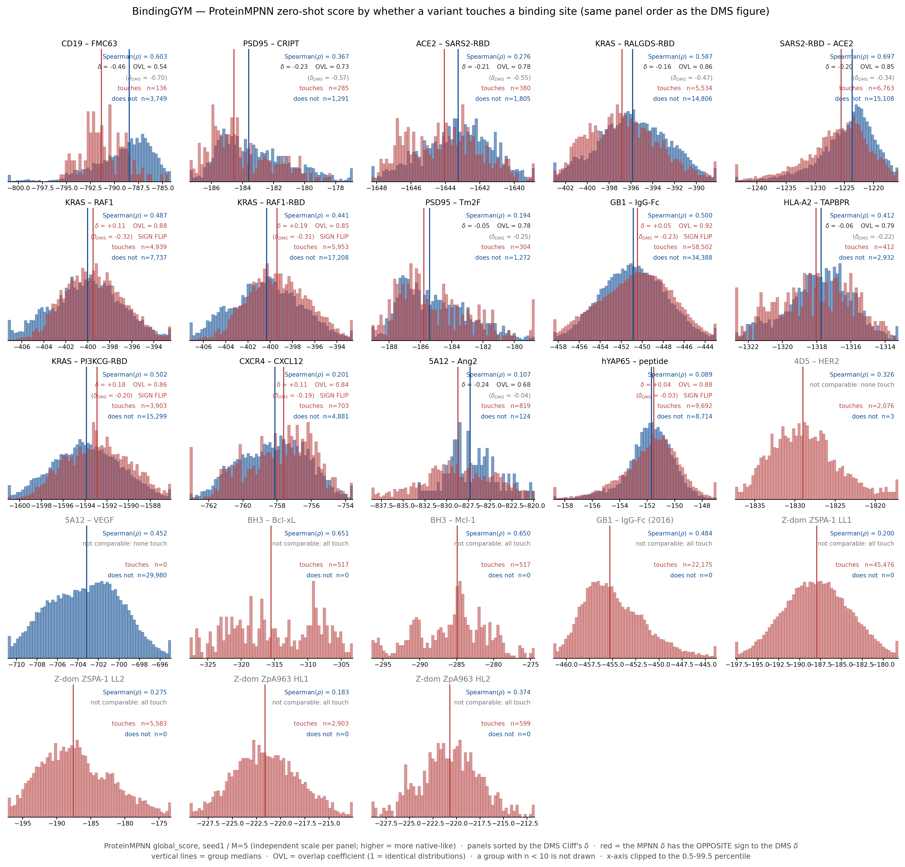
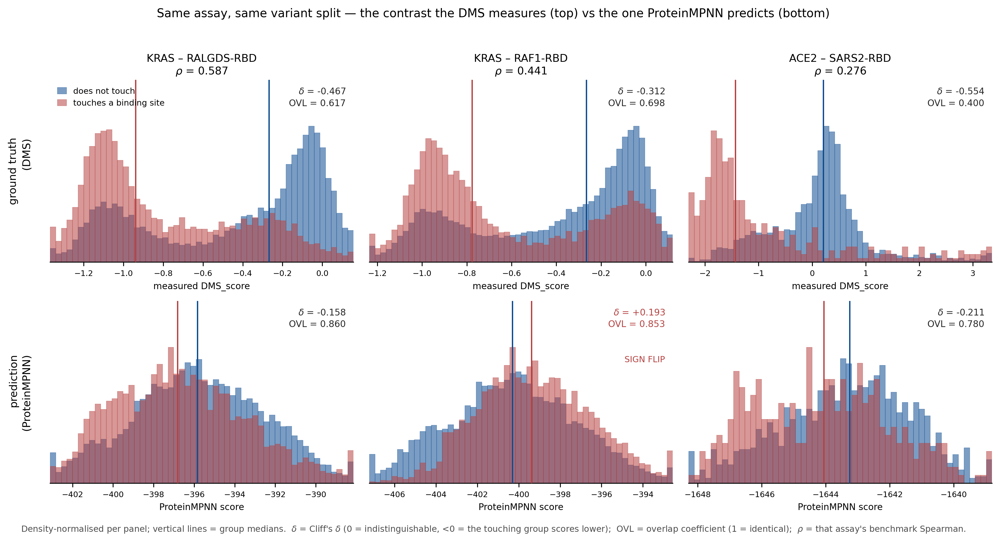
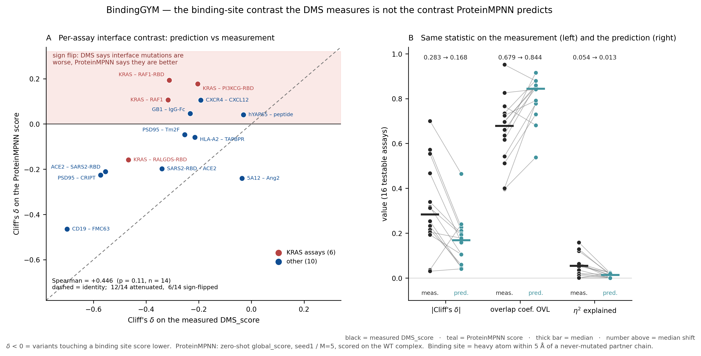
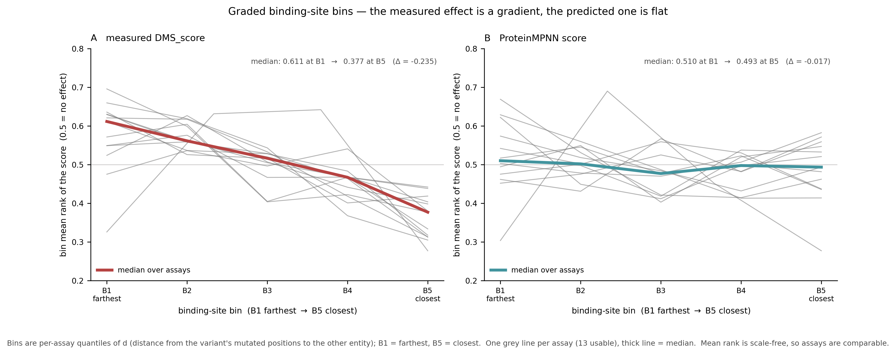
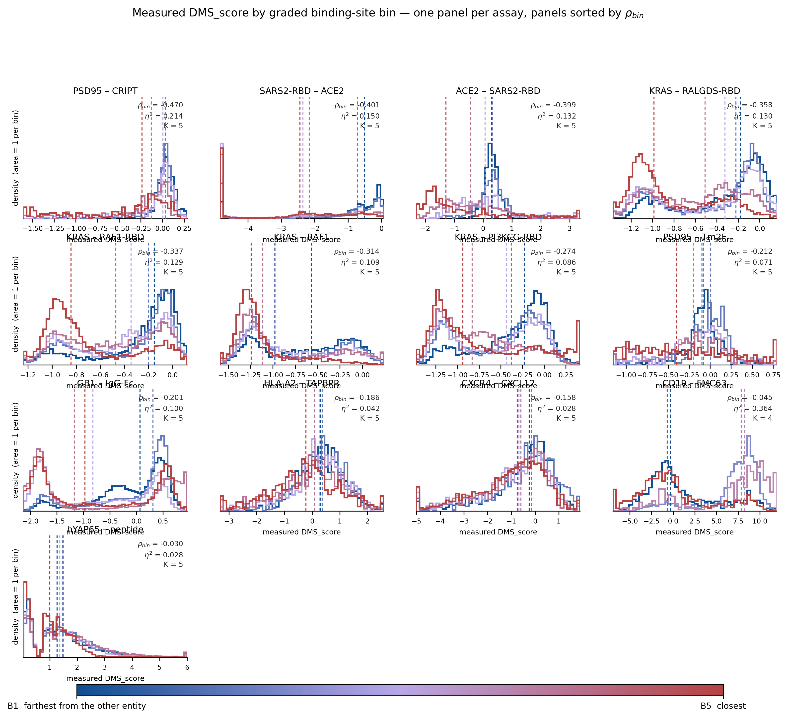

# BindingGYM 的 binding sites：定义、统计，以及 ProteinMPNN 有没有学到它

2026-09-03 · 分支 `bindingGYM-binding-sites-analysis` · 本文是两份细节记录的**汇总版**，
所有数字都在源记录里有完整推导与校验：
[`../binding-sites-analysis/BindingGYM_binding_sites_20260829.md`](../binding-sites-analysis/BindingGYM_binding_sites_20260829.md)（定义、统计、真值）
· [`../binding-sites-analysis-pred/mpnn_interface_contrast_20260902.md`](../binding-sites-analysis-pred/mpnn_interface_contrast_20260902.md)（模型预测）

> 🔴 **评测口径（2026-09-12 起）。** 三个**嵌套**集合，引用任何数字前先确认是哪一个 ——
> 推导见 `scripts/binding_sites_overview/o5_basis23.py`，**从原始数据算出，不是写死的名单**：
>
> | 集合 | n | 怎么来的 | 用在 |
> |---|---:|---|---|
> | **23** | 23 | BindingGYM 25 个减去 `KRAS_DARPinK27_5O2S`、`KRAS_SOS1_8BE4`（label 逐值重复，见 `Sources/datasets/BindingGYM-issues/`） | **§1、§3** |
> | **14** | 14 | 23 中**二值界面分组两侧都 ≥30** 的（另 9 个全碰或全不碰，二值指示量恒定） | **§4、§5** |
> | **13** | 13 | 14 中还能切出 **≥3 档且每档 ≥30** 的（`5A12_Ang2` 的 `d` 只够 2 档） | **§6** |
>
> ⚠️ **已发表数字（zero-shot 0.397、`inter_cluster` 0.42）是 25-assay 口径，与本文任何数字都不可直接比。**
> 本文只报**同一批 assay 上我们自己算的**量。

---

## 0. 一页摘要

| 问题 | 回答 |
|---|---|
| 界面效应是渐变还是阈值？ | **渐变**（§6）。5 档下真值 ρ_bin 在 13/13 为负；把 5 Å 两侧各自内部单独看，趋势依然显著。二值标签是有损摘要 —— 分档解释的方差是二值的 **2.0×**。 |
| binding-site 怎么定义？ | 在 WT 复合物上，按**元数据**把链分成两个 binding entity；**到另一个 entity 的最小重原子距离 ≤ 5 Å** 的残基就是 binding site。同 entity 内的链间接触（如 VH–VL packing）不算。 |
| 多少 mutants 不碰界面？ | assay 未加权均值 **46.6%**，variant 加权 **47.2%**。但分布**双峰**（8 个 assay ≈0、13 个在 0.37–0.97），这个均值不描述任何一个 assay。 |
| 真值上两组有差异吗？ | **有，方向一致：14/14 个可检验 assay 的 δ 都是负的**（碰界面更差）。但**效应量小**：OVL 中位 0.679、η² 中位 0.054。 |
| ProteinMPNN 学到了吗？ | **没有。** 只有 **8/14** 个 assay 方向对，另 **6 个符号翻转**；OVL 升到 **0.844**、η² 掉到 **0.013**。逐 assay 的界面敏感度与真值**不相关**（ρ = +0.446, p = 0.11）。 |
| 榜单成绩能说明这件事吗？ | **不能。** Spearman(ρ, δ_MPNN) = **−0.007, p = 0.98** —— 排得准和界面区分对不对，几乎无关。 |

---

## 1. binding-sites 的定义

> **一句话：** 在该 assay 唯一那份 **WT 复合物**结构上，先按**元数据**（而非 mutation 数据）把链划成
> 两个 binding entity，则**任一重原子到「另一个 entity」的最小距离 ≤ 5 Å 的残基**就是 binding site。

**形式化.** 设结构 `S` 的链集合为 `C(S)`，划分成两个非空不交的 binding entity，并集为 `C(S)`。
对残基 `r`（属于 `E_i`），记 `A(r)` = 它的**全部非氢原子**（backbone + side chain）：

```
d(r) = min over { a in A(r),  b in A(E_other) }  of  || x_a - x_b ||₂
r 属于 binding-sites(S)   <=>   d(r) <= 5.0 Å
```

**variant 级标签**：variant `v` 的突变位点集合 `M(v)`（跨所有链），

```
iface(v) = 1   <=>   M(v) 中存在某个位点落在 binding-sites(S) 上
```

即**只要有任一突变位点在界面上就算「碰界面」**，与突变个数无关。WT 行（`M(v)` 为空）未定义，从所有分析剔除。

**三件必须讲清的事：**

1. **entity 划分只由元数据定。** `DMS_id` 就写着两个 partner（`4D5_HER2` = Fab 4D5 vs HER2）。
   23 个 assay 里 **20 个是 2 条链、划分唯一确定**；只有 3 个抗体–抗原 assay（4D5、5A12×2）需要人工指定
   链归属。**不用 mutation 数据来定**，因为界面是复合物的性质，不是文库的性质。
2. **同 entity 内的接触被排除。** 以 `4D5_HER2` 为例：只算 `A(VL)→C(HER2)` 与 `B(VH)→C`，
   **`A↔B` 的 VH–VL packing 不算**。这一条差别很大：本口径给 **20** 个界面残基，
   而「到任意其它链」的旧口径给 **106** 个（5.3× 膨胀，几乎全是 VH–VL packing）。
3. **5 Å 是接触的几何代理，不是相互作用强度。** 它覆盖 van der Waals / 氢键 / 盐桥的典型距离，
   但不度量强度、不含长程静电。cutoff 敏感性：4.0 / 4.5 / 5.0 / 6.0 Å 下「不碰界面」的 variant 加权比例是
   0.531 / 0.479 / 0.472 / 0.434 —— **4–6 Å 区间稳定在 43–53%**；换成 ΔSASA > 1 Ų 的标准界面定义给 0.461，几乎等价。

**前提（22 个结构逐条实测，源记录 §2.1 带 assert）：** 记录类型只有 `ATOM`/`TER`/`END`，
**HETATM = 0** ⇒ 没有配体/水/金属（**KRAS 复合物里因此没有 GDP/GTP 与 Mg²⁺**）；无 altLoc；
元素列无空值；只有 20 种标准氨基酸；insertion code 仅 `4ZFF`/`4ZFG`（Kabat）。
9,931 个序列位点中 9,493 有坐标（缺 4.41%），但**无坐标的文库位点 = 0** ⇒ 每个被打分的突变都可判定。

---

## 2. 指标定义（只保留四个）

| 记号 | 它在问什么 | 怎么读 |
|---|---|---|
| **δ**（Cliff's δ = 2·AUC−1） | 随机各取一个「碰界面」和一个「不碰」的 variant，**哪边分数更高**？ | −1…+1。**0 = 两组不可区分**；**δ < 0 = 碰界面那组更低**（= 更差）；\|δ\| 越大分得越开 |
| **OVL**（overlap coefficient） | 两个分布**重合了多少质量**？ | 0…1。**1 = 完全重合（毫无区分）**，0 = 完全分离 |
| **η²** | 「碰不碰界面」这个**二值标签能解释分数波动的百分之几** | 0…1。0.05 = 只解释 5% |
| **ρ**（Spearman） | 该 assay 上**模型排序准不准** —— BindingGYM 的榜单指标 | −1…+1，越高越准 |

> **δ 和 ρ 问的是两件不同的事。** ρ 问「模型在这个 assay 上排得准不准」（榜单关心的）；
> δ 问「模型有没有把『界面 vs 非界面』这个区分做对」（本文关心的）。§5 会给出：**两者几乎无关。**
>
> 显著性检验（Mann–Whitney U + BH-FDR）在源记录里逐 assay 报告：真值侧 15/16 个 assay q<0.05、
> 模型侧 14/16。本文只保留效应量 —— 在几千到几万的样本量下「显著」是廉价的，**效应量才是问题所在**。

---

## 3. BindingGYM 的 binding-site 统计

### 3.1 每个 assay 的 binding-site 残基

| assay | E1 中被突变的链 | 另一个 entity | binding-site 残基（PDB 编号，逐链） | n_site / L |
|---|---|---|---|---|
| 4D5_HER2_fitness_1N8Z | AB | C | `A`: 30-32,49-50,53,91-94<br>`B`: 33,50,52,57-59,99,103-105 | 20/434 |
| 5A12_Ang2_fitness_4ZFG | HL | A | `H`: 33,35,58,97-99,100A<br>`L`: 27-31,66-68,91-94,96,27A | 21/428 |
| 5A12_VEGF_fitness_4ZFF | HL | C | `H`: 30-32,95-99,100A<br>`L`: 49,53 | 11/424 |
| Z-domain_ZpA963_HL1_fitness_2M5A | AB | (none: both sides mutated) | `A`: 5-6,9-10,13-14,17-18,20,24,27-28,31-32,34-36<br>`B`: 101,105,110,113-114,117-125,127-129,131-132,135 | 37/116 |
| Z-domain_ZpA963_HL2_fitness_2M5A | AB | (none: both sides mutated) | `A`: 5-6,9-10,13-14,17-18,20,24,27-28,31-32,34-36<br>`B`: 101,105,110,113-114,117-125,127-129,131-132,135 | 37/116 |
| Z-domain_ZSPA-1_LL1_fitness_1LP1 | AB | (none: both sides mutated) | `A`: 5-7,9-11,13-14,17,24,27-28,31-36,38<br>`B`: 6-7,9-11,13-14,17-18,24,27-29,31-32,34-35 | 36/109 |
| Z-domain_ZSPA-1_LL2_fitness_1LP1 | AB | (none: both sides mutated) | `A`: 5-7,9-11,13-14,17,24,27-28,31-36,38<br>`B`: 6-7,9-11,13-14,17-18,24,27-29,31-32,34-35 | 36/109 |
| CXCR4_CXCL12_enrich_8U4O | R | J | `R`: 24-30,37,41,45,94,97-98,113,116,178-181,185-187,189,193,200,203,255,259,262,266,268,277,281,284-285,288,292 | 37/295 |
| hYAP65_peptide_FunctioncalScore_1JMQ | A | P | `A`: 22,26,28,30-32,35-39 | 11/46 |
| GB1_IgG-Fc_fitness_1FCC | C | A | `C`: 23-25,27-28,31-32,34-35,39-45,52,54 | 18/56 |
| GB1_IgG-Fc_fitness_1FCC_2016 | C | A | `C`: 23-25,27-28,31-32,34-35,39-45,52,54 | 18/56 |
| SARS2-RBD_ACE2_deltaKd_6M0J | E | A | `E`: 417,446-447,449,453,455-456,473,475-476,484,486-487,489,493,496,498,500-502,505 | 21/194 |
| KRAS_PICK3CG-RBD_norfitness_1HE8 | B | A | `B`: 3,21,24-25,31,33,36-41,64,67,70,73 | 16/166 |
| KRAS_RAF1_norfitness_6VJJ | A | B | `A`: 3,21,24-25,27,29,31,33,36-41,64,67,71 | 17/168 |
| KRAS_RAF1-RBD_norfitness_6VJJ | A | B | `A`: 3,21,24-25,27,29,31,33,36-41,64,67,71 | 17/168 |
| KRAS_RALGDS-RBD_norfitness_1LFD | B | A | `B`: 221,224-225,233-241,256,264,267 | 15/167 |
| BH3_Mcl-1_normed_3KZ0 | C | A | `C`: 2-7,9-11,13-18,21-23 | 18/23 |
| BH3_Bcl-xL_normed_1PQ1 | B | A | `B`: 85-88,90-95,97-102,104-105,108-109 | 20/33 |
| HLA-A2_TAPBPR_meanscore_5WER | A | C | `A`: 6,84,111,113,115,122,125,127-129,132-136,138,141-142,144-146,148,194-196,198,202,227-232,234,244 | 35/265 |
| PSD95_CRIPT_1BE9 | A | B | `A`: 318,322-329,331,339,372,376,379-380 | 15/115 |
| PSD95_Tm2F_1BE9 | A | B | `A`: 318,322-329,331,339-340,372,376,379-380 | 16/115 |
| ACE2_SARS2-RBD_enrich_6M17 | B | E | `B`: 24,27-28,30-31,34-35,37-38,41-42,45,82-83,330,353-355,357,393 | 20/748 |
| CD19_FMC63_Fitness_7URV | C | D | `C`: 155,157,160,162-168,217-223 | 17/218 |

> 残基号为 **PDB 编号**。逐位点、含序列编号的完整清单见 `../binding-sites-analysis/data/binding_sites_per_chain.csv`；
> **两侧全链的逐残基标注**（9,493 行，含 partner 侧与文库从未碰过的位点）见
> `../binding-sites-analysis/data/interface_residues_all_chains.csv`。

**这些界面落在教科书位置上**（没有任何人工标注）：`SARS2-RBD_ACE2_6M0J` → K417/L455/F456/Y473/E484/F486/N487/Y489/Q493/Q498/N501/Y505，
正是公认的 RBD–ACE2 接触面；6 个 KRAS assay → 全部集中在 **switch I（30–40）+ switch II**；
`PSD95_CRIPT` → **GLGF 基序（322–325）**与肽结合槽。

### 3.2 哪些 mutants 在 binding-sites 上

| assay | n_var | 库位点数 | 其中在 binding-site 上 | n(碰) | n(不碰) | **frac 不碰** |
|---|---:|---:|---:|---:|---:|---:|
| Z-domain_ZpA963_HL1_fitness_2M5A | 2,903 | 6 | 6 | 2,903 | 0 | **0.000** |
| Z-domain_ZSPA-1_LL2_fitness_1LP1 | 5,583 | 8 | 8 | 5,583 | 0 | **0.000** |
| Z-domain_ZSPA-1_LL1_fitness_1LP1 | 45,476 | 9 | 9 | 45,476 | 0 | **0.000** |
| Z-domain_ZpA963_HL2_fitness_2M5A | 599 | 6 | 6 | 599 | 0 | **0.000** |
| GB1_IgG-Fc_fitness_1FCC_2016 | 22,175 | 4 | 4 | 22,175 | 0 | **0.000** |
| BH3_Mcl-1_normed_3KZ0 | 517 | 10 | 10 | 517 | 0 | **0.000** |
| BH3_Bcl-xL_normed_1PQ1 | 517 | 10 | 10 | 517 | 0 | **0.000** |
| 4D5_HER2_fitness_1N8Z | 2,079 | 9 | 4 | 2,076 | 3 | **0.001** |
| 5A12_Ang2_fitness_4ZFG | 943 | 9 | 4 | 819 | 124 | **0.132** |
| GB1_IgG-Fc_fitness_1FCC | 92,890 | 55 | 18 | 58,502 | 34,388 | **0.370** |
| hYAP65_peptide_FunctioncalScore_1JMQ | 18,406 | 34 | 11 | 9,692 | 8,714 | **0.473** |
| KRAS_RAF1_norfitness_6VJJ | 12,676 | 63 | 15 | 4,939 | 7,737 | **0.610** |
| SARS2-RBD_ACE2_deltaKd_6M0J | 21,871 | 194 | 21 | 6,763 | 15,108 | **0.691** |
| KRAS_RALGDS-RBD_norfitness_1LFD | 20,340 | 164 | 15 | 5,534 | 14,806 | **0.728** |
| KRAS_RAF1-RBD_norfitness_6VJJ | 23,161 | 166 | 17 | 5,953 | 17,208 | **0.743** |
| KRAS_PICK3CG-RBD_norfitness_1HE8 | 19,202 | 164 | 16 | 3,903 | 15,299 | **0.797** |
| PSD95_Tm2F_1BE9 | 1,576 | 83 | 16 | 304 | 1,272 | **0.807** |
| PSD95_CRIPT_1BE9 | 1,576 | 83 | 15 | 285 | 1,291 | **0.819** |
| ACE2_SARS2-RBD_enrich_6M17 | 2,185 | 115 | 20 | 380 | 1,805 | **0.826** |
| CXCR4_CXCL12_enrich_8U4O | 5,584 | 295 | 37 | 703 | 4,881 | **0.874** |
| HLA-A2_TAPBPR_meanscore_5WER | 3,344 | 180 | 22 | 412 | 2,932 | **0.877** |
| CD19_FMC63_Fitness_7URV | 3,885 | 218 | 17 | 136 | 3,749 | **0.965** |
| 5A12_VEGF_fitness_4ZFF | 29,980 | 9 | 0 | 0 | 29,980 | **1.000** |

**两个观察：**

1. **分布是双峰的，均值不描述任何 assay。** 8 个 assay ≈ 0.000、1 个 0.132、13 个在 0.370–0.965、1 个 1.000。
2. **成因是文库设计，不是生物学。** `n_lib_pos` 在 **10 与 34 之间有干净断层**：

   | 文库类型 | assay 数 | variant 数 | frac 不碰界面（assay 均值） |
   |---|---:|---:|---:|
   | **设计型小文库**（≤10 个位点：CDR、随机化螺旋） | 10 | 110,772 | **0.113** |
   | **饱和扫描**（≥34 个位点，多数覆盖整条链） | 13 | 226,696 | **0.737** |

   对饱和扫描的 assay，「大部分突变不碰界面」是**几何必然** —— 界面残基只占被突变链的 2.7–32%（中位 10.8%）。

---

## 4. 真值 DMS_score 在两组上的分布

| assay | n 碰 / 不碰 | mean 碰 / 不碰 | median 碰 / 不碰 | **δ** | **OVL** | **η²** |
|---|---:|---:|---:|---:|---:|---:|
| CD19_FMC63_Fitness_7URV | 136 / 3,749 | -1.98 / 4.50 | -1.88 / 6.56 | **-0.700** | **0.397** | **0.057** |
| PSD95_CRIPT_1BE9 | 285 / 1,291 | -0.52 / -0.10 | -0.27 / 0.01 | **-0.573** | **0.512** | **0.158** |
| ACE2_SARS2-RBD_enrich_6M17 | 380 / 1,805 | -0.87 / 0.12 | -1.43 / 0.21 | **-0.554** | **0.400** | **0.120** |
| KRAS_RALGDS-RBD_norfitness_1LFD | 5,534 / 14,806 | -0.80 / -0.44 | -0.94 / -0.27 | **-0.467** | **0.617** | **0.128** |
| SARS2-RBD_ACE2_deltaKd_6M0J | 6,763 / 15,108 | -2.73 / -1.82 | -2.38 / -0.89 | **-0.339** | **0.661** | **0.051** |
| KRAS_RAF1_norfitness_6VJJ | 4,939 / 7,737 | -1.00 / -0.73 | -1.19 / -0.82 | **-0.317** | **0.735** | **0.063** |
| KRAS_RAF1-RBD_norfitness_6VJJ | 5,953 / 17,208 | -0.63 / -0.40 | -0.78 / -0.27 | **-0.312** | **0.698** | **0.065** |
| PSD95_Tm2F_1BE9 | 304 / 1,272 | -0.32 / -0.13 | -0.40 / -0.08 | **-0.254** | **0.542** | **0.035** |
| GB1_IgG-Fc_fitness_1FCC | 58,502 / 34,388 | -0.66 / -0.13 | -0.64 / 0.16 | **-0.232** | **0.636** | **0.063** |
| HLA-A2_TAPBPR_meanscore_5WER | 412 / 2,932 | -0.28 / 0.16 | -0.26 / 0.22 | **-0.215** | **0.725** | **0.018** |
| KRAS_PICK3CG-RBD_norfitness_1HE8 | 3,903 / 15,299 | -0.73 / -0.55 | -0.93 / -0.46 | **-0.204** | **0.697** | **0.019** |
| CXCR4_CXCL12_enrich_8U4O | 703 / 4,881 | -1.16 / -0.71 | -0.88 / -0.39 | **-0.193** | **0.826** | **0.011** |
| 5A12_Ang2_fitness_4ZFG | 819 / 124 | -0.09 / -0.09 | -0.09 / -0.08 | **-0.036** | **0.766** | **0.000** |
| hYAP65_peptide_FunctioncalScore_1JMQ | 9,692 / 8,714 | 1.47 / 1.52 | 1.34 / 1.37 | **-0.030** | **0.952** | **0.000** |



***Figure 1.** **23 个 assay** 各一格，密度归一。红=碰 binding site、蓝=不碰；
红/蓝实线 = 各组中位数，黑色虚线 = WT 锚点（3 个 assay 无 WT 行）。按 δ 升序，
灰标题 = 一侧子集为空、无法比较。**9 个 assay 不可检验**（一侧 < 30）⇒ 统计只在 **14** 个上做。*

**观察 / 结论：**

1. **方向完全一致：14/14 个可检验 assay 的 δ 都是负的** —— 碰界面的 variant 系统性更差。
2. **但效应量小。** \|δ\| 中位 **0.283**、**OVL 中位 0.679**（两组约 68% 的质量是重叠的）、
   **η² 中位 0.054**（界面标签只解释 5% 的方差）。
3. **不碰界面那一组不是「死的」** —— 它保留了全 assay IQR 的**中位 92%**，覆盖几乎完整的 fitness 动态范围。
   ⇒ **不能**用「~47% 不碰界面」推出「这批数据与结合无关」。
4. **形状是双峰的**（死变体堆在下限、功能变体在上限）。界面标签改变的是**两个峰的相对高度**，
   而不是把两群分开 —— 典型如 `KRAS–DARPin K27`、`GB1–IgG-Fc`。
5. 效应最强的 `CD19_FMC63`（δ = −0.700）**别过度解读**：它的分数尺度最反常（sd 2.9/4.9），
   且 ρ(n_mut, DMS_score) = +0.735，与其余 19 个多深度 assay 方向相反。

---

## 5. ProteinMPNN 预测在两组上的分布，以及逐 assay 对比

分数来源：官方 zero-shot 协议，`global_score`，seed1 / M=5，**在 WT 复合物上打分**。
per-variant 分数是既有产出（0 GPU-h），用前过了三道 gate —— 行数吻合、`DMS_score` 逐元素对齐、
逐 assay Spearman 复现到 **6.9e-17**（均值 0.391356）。



***Figure 2.** **23 个 assay**，与 Figure 1 **完全相同的布局与面板顺序**，因此可以逐格对照。每格右上：
蓝色 `Spearman(ρ)` = 该 assay 的榜单成绩；`δ`/`OVL` = 本图两组的对比；`(δ_DMS)` = 真值上的同一个量；
**红色 "SIGN FLIP" = MPNN 的 δ 与真值的 δ 符号相反**。*

### 5.1 三个 example assay 的逐格对比



***Figure 3.** 三个 assay 都在 14 个工作集内。同一个 assay、同一套 variant 划分：上排是真值测量，下排是模型预测，往下读一列即可。
`KRAS–RAF1-RBD`（中）是**符号翻转**的例子 —— 下排两条中位线的**前后顺序反了**。*

**一眼可见的三件事：** 上排是**分得很开的双峰**，下排是**叠在一起的单峰**；
模型的 OVL 从 0.617 / 0.698 / 0.400 升到 0.860 / 0.853 / 0.780；
中间那一列模型把方向搞反了（δ 从 −0.312 变成 **+0.193**）。

### 5.2 逐 assay 对比

| assay | **δ** 真值 | **δ** MPNN | 符号 | **OVL** 真值 | **OVL** MPNN | **η²** 真值 | **η²** MPNN | **ρ** |
|---|---:|---:|:--:|---:|---:|---:|---:|---:|
| CD19_FMC63_Fitness_7URV | -0.700 | **-0.465** | 一致 | 0.397 | 0.538 | 0.057 | 0.014 | 0.603 |
| PSD95_CRIPT_1BE9 | -0.573 | **-0.226** | 一致 | 0.512 | 0.730 | 0.158 | 0.022 | 0.367 |
| ACE2_SARS2-RBD_enrich_6M17 | -0.554 | **-0.211** | 一致 | 0.400 | 0.780 | 0.120 | 0.019 | 0.276 |
| KRAS_RALGDS-RBD_norfitness_1LFD | -0.467 | **-0.158** | 一致 | 0.617 | 0.860 | 0.128 | 0.013 | 0.587 |
| SARS2-RBD_ACE2_deltaKd_6M0J | -0.339 | **-0.198** | 一致 | 0.661 | 0.846 | 0.051 | 0.025 | 0.697 |
| KRAS_RAF1_norfitness_6VJJ | -0.317 | **+0.107** | **翻转** | 0.735 | 0.881 | 0.063 | 0.010 | 0.487 |
| KRAS_RAF1-RBD_norfitness_6VJJ | -0.312 | **+0.193** | **翻转** | 0.698 | 0.853 | 0.065 | 0.023 | 0.441 |
| PSD95_Tm2F_1BE9 | -0.254 | **-0.047** | 一致 | 0.542 | 0.777 | 0.035 | 0.000 | 0.194 |
| GB1_IgG-Fc_fitness_1FCC | -0.232 | **+0.046** | **翻转** | 0.636 | 0.916 | 0.063 | 0.001 | 0.500 |
| HLA-A2_TAPBPR_meanscore_5WER | -0.215 | **-0.059** | 一致 | 0.725 | 0.791 | 0.018 | 0.002 | 0.412 |
| KRAS_PICK3CG-RBD_norfitness_1HE8 | -0.204 | **+0.178** | **翻转** | 0.697 | 0.859 | 0.019 | 0.016 | 0.502 |
| CXCR4_CXCL12_enrich_8U4O | -0.193 | **+0.105** | **翻转** | 0.826 | 0.841 | 0.011 | 0.002 | 0.201 |
| 5A12_Ang2_fitness_4ZFG | -0.036 | **-0.240** | 一致 | 0.766 | 0.681 | 0.000 | 0.020 | 0.107 |
| hYAP65_peptide_FunctioncalScore_1JMQ | -0.030 | **+0.041** | **翻转** | 0.952 | 0.879 | 0.000 | 0.000 | 0.089 |

**三步读法：** ① 先比前两列 δ 的**符号**（第 4 列直接给判定）；
② 再比两个 δ 的**绝对值**（如 `PSD95_CRIPT` 真值 −0.573 → 模型 −0.226，方向对但力度不到一半）；
③ 最后看 OVL 两列（如 `KRAS_RALGDS-RBD` 0.617 → 0.860，真值下还有 38% 质量分开，模型只剩 14%）。

### 5.3 汇总



***Figure 4.** **14 个 assay**。左：逐 assay 的 δ 散点（虚线 = identity，粉色带 = 符号翻转区，红点 = KRAS assay）。
右：同一个统计量在真值（黑）与预测（青）上的配对比较，粗线 = 中位数。*

| | δ<0 的 assay 数 | \|δ\| 中位 | OVL 中位 | η² 中位 |
|---|---:|---:|---:|---:|
| **真值 DMS** | **14/14** | 0.283 | 0.679 | 0.054 |
| **ProteinMPNN** | **8/14** | **0.168** | **0.844** | **0.013** |

**结论：ProteinMPNN 没有学到 binding-site 这个区分。**

1. **方向一致性崩了。** 真值 14/14 全负；模型只有 8/14，另 **6 个符号翻转** —— 模型认为碰界面的突变**更被容忍**。
   **4 个 KRAS assay 里 3 个翻转**（RAF1 +0.107、RAF1-RBD +0.193、PI3KCG +0.178；DARPinK27 与 SOS1 已排除），
   而真值给的是 −0.20 ~ −0.47。
2. **效应量缩水约一半**：\|δ\| 中位 0.283 → 0.168，**12/14 被衰减**，中位比值 **0.470**。
3. **重叠度显著上升、方差解释力掉 4×**：OVL 0.679 → **0.844**，η² 0.054 → **0.013**。
4. **逐 assay 的界面敏感度互不相关**：ρ(δ_真值, δ_MPNN) = **+0.446, p = 0.11**。
   即模型不只是「幅度小」，而是**排序都对不上** —— 它在哪些 assay 上对界面敏感，与真实情况无关。
5. **形状也不同**：真值双峰，模型平滑单峰 —— 它**没有「死变体」这个模式的概念**。
6. **榜单成绩说明不了这件事**：Spearman(ρ, δ_MPNN) = **−0.007, p = 0.98**；
   6 个翻转 assay 的 ρ 中位 0.464 vs 8 个一致的 0.389（Mann–Whitney **p = 0.85**）。
   `KRAS_PI3KCG-RBD` 是典型：**ρ = 0.502 偏高，δ = +0.178 符号翻转**。
   ⇒ **想用 benchmark ρ 论证「模型懂不懂界面」是无效的，必须直接量 δ。**

**机制尚未证明。** 「MPNN 只建模折叠时的 sequence–structure compatibility」是一个**合理但未被检验**的解释；
本文只给出**现象**。唯一能定机制的实验是**把 partner 链删掉重新 zero-shot 打分**再算 δ
（δ 不变 ⇒ 界面敏感度全部内生；δ 变 ⇒ 模型用了 partner 但用得不好），**≈1.5–2 GPU-h，尚未跑**。

---

## 6. 把二分类换成 5 档：界面效应是**渐变**，不是阈值

> 本节 2026-09-12 新增。§4/§5 用的是 `d ≤ 5 Å` 的**二分类**。它能说「两组有差异但重叠 0.679」，
> **但说不出这个差异是渐变的还是 5 Å 处的一次阶跃**。这一节把同一个框架的 **K 从 2 换成 5**。

### 6.1 这一节要验证什么

**Hypothesis**：界面效应是**关于距离 `d` 的单调渐变**，而不是发生在 5 Å 的阈值。

- **若渐变成立** ⇒ 二值标签只是这个渐变的**有损摘要** ⇒ 也就解释了为什么连续特征在下游明显更好；
- **若是阈值** ⇒ 二值标签在正确 cutoff 下已经够用，连续特征的优势得另找解释。

### 6.2 实验系统（与 §4/§5 同一个，只换 K）

把每个 assay 的 variants 按 **`d` 的分位数**切成 **K = 5 档**，`B1` = **离另一个 entity 最远**、
`B5` = **最近**。因为 `exp(−d/5Å)` 是 `d` 的严格单调函数，**按它分位数分档与按 `d` 分档完全等价**。

§4/§5 的每个量都有对应的推广：

| K = 2（§4/§5） | K = 5（本节） |
|---|---|
| Cliff's **δ**（两组谁高） | **ρ_bin**，见下方定义 |
| **η²**（二值标签解释的方差） | **η²**（5 档解释的方差） |
| 两组的分布重叠 | 5 条分布曲线的逐档位移 |

#### ρ_bin 到底是什么

**`ρ_bin = Spearman(档序号, DMS_score)`，在该 assay 的全部 variant 上算。** 每个 variant 有两个数：
它落在哪一档（1–5），和它的 DMS_score。所以它就是**「按距离的粗粒化排序」与「按 DMS_score 的排序」之间的
秩相关** —— 与你的理解一致，只是距离那一侧被**粗粒化成了 5 档**，不是原始距离的全排序。

**符号：档序号越大 = 离另一个 entity 越近**（B1 最远、B5 最近）。越近越容易破坏结合 ⇒ DMS_score 越低
⇒ **ρ_bin 为负 = 「越近越差」**。用 `KRAS–RALGDS-RBD` 实算：

| 档 | n | `d` 范围 (Å) | DMS 中位 |
|---|---:|---:|---:|
| **B1**（最远） | 4,306 | 13.29 – 32.49 | **−0.178** |
| B2 | 3,962 | 9.03 – 13.13 | −0.221 |
| B3 | 4,025 | 6.70 – 8.83 | −0.323 |
| B4 | 4,039 | 4.18 – 6.63 | −0.509 |
| **B5**（最近） | 4,008 | 2.69 – 3.86 | **−0.986** |

⇒ `ρ_bin = −0.358`。**中位数从 −0.178 一路降到 −0.986，正是「越近越差」。**

> 🔴 **本节有两个符号约定相反的量，不要看混：**
> | 量 | 自变量 | 越大表示 | 「越近越差」时的符号 |
> |---|---|---|---|
> | **ρ_bin**（§6.4 的表、Figure 5/6） | **档序号** | 越**近** | **负** |
> | **Spearman(`d`, DMS)**（§6.5 的阈值检验） | **原始距离 `d`** | 越**远** | **正** |
>
> 两者说的是**同一件事**，只是自变量方向相反（实测 Spearman(档序号, `d`) = **−0.98**）。

### 6.3 口径：**14 个工作集中 13 个可用**

判据：**≥3 档**且**每档 ≥30**。14 个里 **`5A12_Ang2` 不可用** —— 它的 `d` 只有 9 个不同取值，
只切得出 **2 档**。其余 **13 个**可用。

> 本节的 population **取 §4/§5 的 14 个工作集**，而不是 23，这样分档视角与二值视角**逐 assay 可比**，
> 也与 complexTTT 的记录（`workstation-records/mutation-landscape-TTT/`）同口径。
> **代价**：`Z-domain_ZpA963_HL2` 被排除在外 —— 它**全部 variant 都碰界面**（所以不在 14 里），
> 但 `d` 仍有区分度、分档本来是能做的。**分档视角能触及二值视角结构上够不到的 assay，这一点在本节口径下看不到。**

### 6.4 结果



***Figure 5.** 13 个 assay，每条灰线一个，粗线是中位数。**横轴 = 档序号（B1 最远 → B5 最近）；
纵轴 = 该档分数的平均秩**（0.5 = 无效应；用平均秩而不是原始分数，是为了让量纲差异极大的 assay 可比）。
**A = 真值，B = ProteinMPNN 预测。** A 一路下滑 = 越近越差；B 几乎水平 = 模型基本感知不到。*



***Figure 6.** 逐 assay 的分布曲线。**横轴 = 该 assay 的 DMS_score；纵轴 = 密度**（每条曲线下面积 = 1，
所以各档即使 n 不同也可比）。蓝 = 最远（B1）、红 = 最近（B5），**虚线 = 各档的中位数**；面板按 ρ_bin 排序。
从蓝到红逐档左移，就是 ρ_bin 为负的视觉版本。*

| assay | n | K | **ρ_bin** 真值 | ρ_bin MPNN | η² 真值 | η² MPNN | 真值下降步数 | MPNN 下降步数 |
|---|---:|---:|---:|---:|---:|---:|---:|---:|
| PSD95_CRIPT_1BE9 | 1,576 | 5 | **-0.470** | -0.089 | 0.214 | 0.019 | 4/4 | 2/4 |
| SARS2-RBD_ACE2_deltaKd_6M0J | 21,871 | 5 | **-0.401** | -0.261 | 0.150 | 0.097 | 3/4 | 3/4 |
| ACE2_SARS2-RBD_enrich_6M17 | 2,185 | 5 | **-0.399** | -0.283 | 0.132 | 0.086 | 3/4 | 3/4 |
| KRAS_RALGDS-RBD_norfitness_1LFD | 20,340 | 5 | **-0.358** | -0.020 | 0.130 | 0.022 | 4/4 | 2/4 |
| KRAS_RAF1-RBD_norfitness_6VJJ | 23,161 | 5 | **-0.337** | +0.120 | 0.129 | 0.036 | 4/4 | 2/4 |
| KRAS_RAF1_norfitness_6VJJ | 12,676 | 5 | **-0.314** | +0.039 | 0.109 | 0.039 | 3/4 | 1/4 |
| KRAS_PICK3CG-RBD_norfitness_1HE8 | 19,202 | 5 | **-0.274** | +0.121 | 0.086 | 0.023 | 4/4 | 1/4 |
| PSD95_Tm2F_1BE9 | 1,576 | 5 | **-0.212** | -0.060 | 0.071 | 0.004 | 3/4 | 3/4 |
| GB1_IgG-Fc_fitness_1FCC | 92,890 | 5 | **-0.201** | +0.040 | 0.100 | 0.021 | 2/4 | 3/4 |
| HLA-A2_TAPBPR_meanscore_5WER | 3,344 | 5 | **-0.186** | -0.123 | 0.042 | 0.032 | 3/4 | 3/4 |
| CXCR4_CXCL12_enrich_8U4O | 5,584 | 5 | **-0.158** | -0.076 | 0.028 | 0.056 | 2/4 | 2/4 |
| CD19_FMC63_Fitness_7URV | 3,885 | 4 | **-0.045** | -0.115 | 0.364 | 0.352 | 1/3 | 2/3 |
| hYAP65_peptide_FunctioncalScore_1JMQ | 18,406 | 5 | **-0.030** | +0.058 | 0.028 | 0.008 | 2/4 | 2/4 |

### 6.5 观察 / 结论

1. **真值上是一条清晰的单调梯度。ρ_bin 在 13/13 个 assay 上全为负**（中位 **−0.274**）。
   平均秩的中位轨迹 **0.611（B1）→ 0.377（B5）**；相邻档「往下走」的步数占 **75%**（随机是 50%）。
2. **分档比二值多解释一倍的方差**：真值 η² 中位 **0.109**，而同一批 assay 上二值 η² 中位 **0.054**
   ⇒ **2.0×**。**这是「二值标签是有损摘要」的直接量化。**
3. **🔴 是渐变，不是阈值 —— 决定性的子检验**：把 5 Å 两侧各自内部单独看，趋势**依然存在**：

   | 子集 | assay 数 | Spearman(`d`, DMS) 中位 | 方向一致 | p<0.05 |
   |---|---:|---:|---:|---:|
   | **只看 `d > 5 Å`**（全是「不碰」） | 13 | **+0.198** | 10/13 | **13/13** |
   | **只看 `d ≤ 5 Å`**（全是「碰」） | 13 | **+0.082** | 9/13 | 9/13 |

   ⇒ **在「不碰」那一组内部，越远仍然越好；在「碰」那一组内部，越浅仍然越好。**
   5 Å 只是穿过一条连续关系的一刀，**不是一个真实的分界**。
4. **ProteinMPNN 的那条线基本是平的。** ρ_bin 中位 **−0.060**（方向对，但只有真值的 **1/4.5**），
   而且 **5/13 仍然为正**（方向相反）；平均秩轨迹 0.510 → 0.493，几乎不动；
   下降步数占比 57%（接近随机的 50%）。η² 中位 **0.032**，是真值的 **1/3.4**。
5. **逐 assay 仍然对不上**：Spearman(ρ_bin 真值, ρ_bin MPNN) = **+0.247, p = 0.415**。
   与 §5.3 的二值结论一致 —— 模型不只是幅度小，**在哪些 assay 上敏感也与真实情况无关**。
6. **一个诚实的限定**：逐档中位数**严格单调**的只有 4/13。梯度在**秩相关**意义上稳定
   （ρ_bin 13/13 为负），但逐档中位数会小幅抖动 ⇒ 应当读作「单调趋势」，不是「逐档严格递减」。

**对本文档主结论的影响**：§4 的「界面标签只解释 5% 方差」是**二值口径**下的数字。
换成分档，真值的可解释方差翻倍到 **10.9%** —— 效应仍然不大，
但**「界面信息比二值标签显示的更多」**这一点被明确量化了。

## 7. Caveats

1. **界面算在唯一一份 WT 复合物结构上**，22 个结构里 15 个是同源模型（`_hm`）；没有建模突变引起的构象变化。
2. **`4ZFF_CHL.pdb` 只有 3 条链，而 PDB 4ZFF 沉积了 6 条**（VEGF 是同源二聚体）⇒ `5A12_VEGF` 的界面可能被低估
   （它是唯一 frac = 1.000 的 assay，占 benchmark 8% 的 variant）。**没有排除。**
3. ~~`KRAS_SOS1_8BE4` 与 `KRAS_DARPinK27_5O2S` 的 label 逐值重复~~ —— **已通过口径解决**：
   两者自 2026-09-12 起排除在外（顶部口径表）。全文不再包含它们。
4. **三个 assay 的 DMS_score 不像 WT 锚定的结合读数**（`5A12_VEGF` / `CD19_FMC63` / `hYAP65`：
   超越 WT 比例 100% / 70% / 65%，且 ρ(n_mut, score) 为正）。下绝对判断前要回原始文献核口径。
5. **模型侧只有 1 个 seed / M=5。** ⚠️ 注意 per-assay 的解码顺序噪声**不小** —— 5-seed 实测
   σ 中位 **0.0184**、最大 0.0581（常被引用的 0.008 是**聚合均值**的量级，不是单 assay 的）。
   不过 δ 与 ρ_bin 都是**在同一个分数向量上的配对量**，seed 噪声大部分抵消：
   实测 gain 的跨 seed sd 只有 baseline 的 **43%**（见 `workstation-records/mutation-landscape-TTT/` §6.10）。
6. **assay 未加权均值本身是一把有问题的尺子**：23 个 assay 只落成约 13 个真实统计簇
   （KRAS 仍独占 4 个，PSD95 / GB1 各 2 个）⇒ 有效样本量远小于 23。
7. **§6 的 population 是 14 而不是 23**（见 §6.3），所以它触及不到「全部 variant 都碰界面」那一类 assay。

---

## 8. 复现

```
scripts/binding_sites/          s1-s14   界面定义、逐 variant 打标签、真值统计、Figure 1
scripts/binding_sites_pred/     p1-p6    MPNN 分数接入（三道 gate）、对比统计、Figure 2 / 4
scripts/binding_sites_overview/ o1-o5    Figure 3 / 5 / 6、本文全部表格，以及 o5 = 23/14/13 三个口径的推导
```

**图是按本文自己的口径重出的**，不是从别的记录借来的（那两份记录是 25-assay 口径）：

```
ASSAY_EXCLUDE="KRAS_DARPinK27_norfitness_5O2S,KRAS_SOS1_norfitness_8BE4" \
FIG_OUT_DIR=<本目录> FIG_SUFFIX=_23  python scripts/binding_sites/s8_plot.py        # Figure 1
ASSAY_EXCLUDE=... FIG_OUT_DIR=... FIG_SUFFIX=_23  python scripts/binding_sites_pred/p3_plot.py   # Figure 2
ASSAY_EXCLUDE=... FIG_OUT_DIR=... FIG_SUFFIX=_14  python scripts/binding_sites_pred/p5_compare.py # Figure 4
```

- 输入：`/home/guoj0f/share/BindingGYM/input/`；MPNN per-variant 分数在 workstation
  `/data/guoj0f/BindingGYM-zero-shot-proteinMPNN/scores/seed1_M5/`（`p1` 会自动 rsync，不入 repo）
- 纯 CPU，全流程约 8 分钟，无 GPU 依赖
- 依赖：numpy / pandas / scipy / matplotlib（PDB 解析与 SASA 都是自带实现，不需要 biopython）
